---
author:
- La Partida
bibliography: Main.bib
title: LEE ESTO PARA HACER UN CAMBIO REAL
---
# This file contains all the attached chapters previously translated by pandoc, where the references work correctly
No vivimos por, sino a pesar del capitalismo , toda relación social está
mediada por las mercancías . Y el capitalismo ganó hace mucho .

¿Cuáles son las posibilidades de actuar en el momento más incierto y más
absurdo de la Historia desde mi circunstancia específica?

Mientras cientos de activistas marchan religiosamente exigiendo al
gobierno (como si hubiera, de hecho, algo ahí que responda al llamado)
un mundo más libre , más justo , más ecológico , los males propios de
nuestro tiempo están presentes en todo momento en nuestra vida. Se trata
de una configuración tecnológica de la realidad , una disposición de las
cosas para que la gente actúe y responda frente a ellas de cierto modo.
En la era de información, el rostro del totalitarismo se confunde en un
virus capitalista que ciertamente ha dominado la nuda vida: en la
sociedad no hay vida así sin más. Corporaciones , máquinas y aparatos
ejercen su poder sin ninguna resistencia organizada capaz de proponer
una alternativa universal al estado actual de las cosas.

Vivimos una imperceptible guerra civil en la que el enemigo a vencer no
está ni siquiera en el montón de idiotas que rigen las corporaciones y
los gobiernos nacionales, sino en una religiosidad que profesa simpatía
por la dominación mercantil .

# Lee esto para hacer un cambio real

# *Wiki* = Rápido

Esta reflexión escrita nació de notas, discusiones y lecturas entre
fundadoras e integrantes de la organización. Aquí sistematizamos
alrededor de cinco años de investigación de nuestro compromiso por
transformar la forma de hacer política. En el texto se integran visiones
desde y sobre Wikipolítica pero también sobre otros movimientos
autónomos de vanguardia política, en diferentes latitudes y
temporalidades.

Antes de comenzar, es preciso explicar qué es lo wiki y qué significa la
wikipolítica. Wiki viene del hawaiano *wiki wiki* que significa rápido.
Es un concepto popular entre la comunidad del software libre para
referirse a una visión colaborativa de la tecnología. Se popularizó
gracias a Wikipedia, la enciclopedia libre. Fue usada por el programador
Ward Cunningham a mediados del siglo pasado. Esta filosofía también está
inspirada en actores como Aaron Swartz, Richard Stallman y de ella
derivan proyectos de corte político pirata, como Library Genesis y
Science Hub.[^1] Wikipolítica tuvo como precedente el Wikipartido.
Surgió como algo parecido a un Partido pirata. Herederas del #YoSoy132,
nos desarrollamos en una cultura de la colaboración, de la inteligencia
colectiva y de visiones como el movimiento OPEN, que busca fuentes o
código, cultura y espacios abiertos. El mayor acierto desde nuestro
punto de vista fue considerar la tecnología como un componente central
de la construcción contemporánea de lo político.

<!-- TODO: CHOOSE HOW TO RENDER IMAGES -->
<!--  -->

Fuimos influenciadas por las metodologías de diseño y negocios, como el
*Design thinking*, *Scrum* o *Agile*, y modelos de gobernanza
participativa, como la sociocracia. Irónicamente, también aprendimos de
las visiones locales como el *municipalismo libertario* de Murray
Bookchin y reflexiones sobre el derecho a la ciudad. Uno de los pilares
comunicacionales de nuestra organización fue la política del encuentro.
Desafortunadamente, la magnitud del problema de por qué la gente saldría
a la calle a dialogar, cuando vive en la certidumbre del espectáculo (es
decir, del deseo de consumir creado por los medios informativos), hace
estériles todos nuestros esfuerzos por crear una posición política sobre
cualquier cosa.

Según nuestros documentos oficiales, nuestros principios incluyen
democracia real y participativa, derechos humanos, localismo, rendición
de cuentas, justicia social, innovación disruptiva, inteligencia
colectiva, pedagogía política, apertura e inclusión y feminismo. Por
otro lado, nuestros valores son honestidad, solidaridad, comunidad,
deliberación, resiliencia y sustentabilidad. Sin embargo, este marco
ético tiene problemas importantes como establecer criterios para hacer
interactuar los principios, porque su interpretación depende de la
posición desde la cual se concibe el fenómeno político, o de las
capacidades, de las motivaciones de quienes participan y de muchas otras
cuestiones.

La construcción de este proyecto político ha sido señalada por
intelectuales y personas de la crítica como un simulacro *buena onda*
del juego político partidista. Pese a reconocer que nuestra organización
no habla desde conocimientos situados, sino desde las abstracciones
universalistas que caracteriza a la política tradicional de *onvres*, no
creemos que el *buenaondismo* de quienes tuvieron el mando informalmente
fuera un gesto descuidado. Cada vez que alguien evadía la pregunta de en
qué posición del espectro político nos encontrábamos, hacía una posición
estratégica, pero también intelectual, al hablar sobre una entidad
política en formación que requiere responder ciertas cuestiones para
poder presentarse públicamente a distintas audiencias que la legitiman.
Muy probablemente se ha dicho poco sobre nuestras posiciones por la
incapacidad de reconocer un hecho fundamental de toda política del
futuro y ese hecho es que nuestras posiciones intelectuales son
necesariamente estratégicas en la medida en que hasta el más mínimo
pronunciamiento contiene en sí una visión del mundo que requiere ser
justificada si quiere ser considerada como una alternativa seria.

Al titubeo público de nuestra fuerza política nosotras le decimos
*ciudadanismo radical* por plantear al ciudadano común como la
subjetividad, como "la persona", en disputa contra la partidocracia,
entendida como un conjunto de ratas corruptas cuya existencia supone la
raíz de todos los problemas. Esta visión fue la predilecta entre varios
hombres y algunas compañeras, por ser la ideal para justificar la
pretensión de algunas personas para construir una plataforma política
electoral, como lo hiciera Podemos después del 15M o movimiento de los
indignados. El hambre poco disimulada de quienes lideraban se apoderó
muy pronto de la organización, aunque el Wikipartido, antecedente de la
Wikipolítica, era un proyecto político un poco distinto a la grilla
burda, era un proyecto de naturaleza radicalmente pirata.

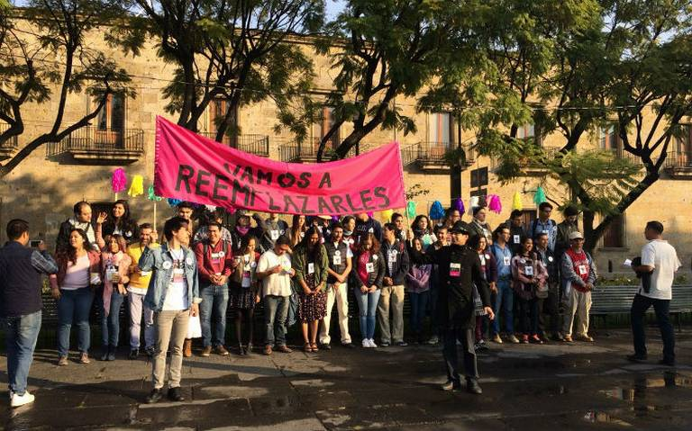

Para muchas de nosotras era inconcebible que un protopartido pirata se
convirtiera en otro partido electorero, aunque las personas que lo
convirtieron en el fracaso electoral que fue, usaron diversas técnicas
de la Ciencia Política para conducir a toda la asamblea hacia su propio
interés. El cambio de piratas a populistas se explica si pensamos que
una organización es un juego con reglas formales e informales. En este
caso, las personas más capaces decidieron renunciar a la consigna
política que crearon, para usar el poder que les da pertenecer a una
élite (familias poderosas, alta educación académica, carisma, estatura,
capacidad para hablar, habilidades de negociación o de ciertas jergas
populares y agendas consensadas en el movimiento #YoSoy132) para
perseguir su beneficio personal con una justificación mediática
suficiente: *somos las personas indignadas que se levantaron en México
para denunciar todos los problemas y encontrar todas las soluciones.*
Quizá muchas de estas personas ignoraban (y quizá todavía lo hacen) el
aura de capital social que les rodea y que las hace prácticamente
intocables frente al asedio de corporaciones económicas y partidistas,
además de agencias de inteligencia que a lo largo de los últimos sesenta
o setenta años se han dedicado a asediar e incluso asesinar a la
oposición popular organizada (o sea a las organizaciones sin integrantes
de abolengo) en México.

Para quienes nos posicionamos por la pregunta de cómo hacer efectiva y
concreta esa otra forma de hacer política, lo primero que aprendimos
fue:

1.  que en México toda forma política es corporativa y está programada
    en nuestra psique a un nivel prácticamente inconsciente,

2.  a pensar en los problemas de responsabilidad individual como
    problemas que se pueden atacar cultivando nuestras potencias,
    fortaleciendo nuestras capacidades y reconociendo nuestras
    necesidades.

No creemos en lo que mucha gente dice, que en México la gente es apática
y apolítica. El espíritu agachado, arrabalero y huevón de que hablaba la
filosofía ---priísta, por cierto--- del mexicano, y que todavía hoy
constituye la ideología *whitexican*, es en realidad la abnegación de
sabernos sin las armas para combatir, de no querer que nuestras
rebeliones no produzcan nada más que muertos y desaparecidos.

Sin embargo, a diferencia de hace unas décadas, hoy estamos en las
condiciones tecnológicas para la conformación efectiva de un nuevo poder
que cimbre el estado actual de las cosas. Para lograr una transformación
real necesitamos accionar desde distintas aristas y facilitando la
conexión estratégica entre distintos grupos políticos que buscan abrir y
liberar flujos, que aumenten las potencias de las personas. La pregunta
pedagógica es:

> ¿cómo conciliamos todas estas cosas que hemos aprendido desde nuestra
> experiencia política con acciones articuladas y de gran escala, en
> diferentes niveles?

Hay que darnos cuenta, por ejemplo, de que el rencor contra la
partidocracia puede venir inconscientemente de desear el derroche, el
exceso y el poder que esa gente tiene. En ese sentido, es importante
hacernos las preguntas: si estuviéramos en sus zapatos, ¿cómo crearíamos
otras formas de poder? ¿Por qué desearíamos renunciar a nuestros
privilegios? ¿Cómo vamos a crear una cultura del encuentro y no del
consumo?

La construcción de esta organización política es una metáfora del diseño
de una nueva configuración del Estado que permita encontrar un más allá
a la catástrofe, que reina a escala micro, molecular, local, y macro,
molar, mundial. Es necesario pensar cómo lidiar con los intereses de
actoras individuales, cómo vamos a desarrollar todas nuestras
capacidades orientadas hacia un cambio multidimensional, desde dónde lo
haremos y cómo conseguiremos recursos.

Estas necesidades se pueden sintetizar, por ejemplo, como
infraestructura tecnológica, para innovar con las herramientas que
conocemos, gestionadas por *geeks* por ejemplo; cartografías del poder a
través de visualizaciones, organigramas y diagramas de flujo
desarrollados por economistas, abogadas y diseñadoras, y documentación
sobre los protocolos que dan vida a una organización resiliente, a
través de procesos y patrones de trabajo.

Así, este texto pretende dar algunas luces a la cuestión de la crisis y
la catástrofe, delinear algunos juegos de ficción utópica y
posibilidades para empezar a configurar esos territorios imposibles.
Desarrollamos algunos síntomas de la crisis política contemporánea,
proponemos un modelo para tratar de navegar entre los múltiples factores
que causan la opresión de las formas de vida, tanto en su relación con
los gobiernos como con sus propios cuerpos. Esta posición escritural es
**La Partida** y podríamos bien señalarla como especulaciones
estratégicas, como una corriente de la táctica política. La pregunta
central que guiará nuestras reflexiones es *cómo nos organizamos* para
un más allá de la catástrofe, cómo creamos un nuevo horizonte. Para
nosotras, la estrategia consiste en acciones para visibilizar y combatir
las asimetrías de oportunidades y capacidades de las personas y la
táctica en configurar prácticas y patrones para las operaciones
concretas en el territorio y fuera de él, partiendo del reconocimiento
de las circunstancias de cualquier persona que actúa, de cómo en ella se
entrecruzan múltiples fuerzas de captura a distintas velocidades.

## ¡Estos son los problemas reales!

### El estado actual de las cosas

Aunque no lo creas, no vivimos por, sino a pesar del capitalismo. Se
calcula que el ritmo de producción de la economía mundial necesita de
aproximadamente siete y medio planetas Tierra para poder vivir de
acuerdo al estándar norteamericano y ser sostenible. La producción de
imágenes para capturar el deseo de todas las personas y orientarlos a la
acumulación de mercancías a través de la industria cultural nos hace
desear el dinero para cumplir con un montón de estereotipos sociales
impuestos por la publicidad. ¿Cómo? A través del miedo y la promesa de
algún día estar por encima de las demás personas. Mientras, el trabajo
se vuelve más precario conforme la optimización y automatización,
administrativa y de procesos, se desarrolla en la economía mundial. A
los desempleos masivos hay que sumar la incapacidad de los Estados de
solventar las deudas sociales, de garantizar algún mínimo de estabilidad
o de responder por la gente viviendo en la miseria. Nadie se da cuenta
de que se enferma por el cambio climático porque no hay responsables
aparentes para la contaminación y deterioro acelerado del planeta y de
los recursos disponibles. El *mainstream* tiende a asociar a la
enfermedad con el azar o a la voluntad de Dios, una creencia azarosa que
solo hace que las personas sigan aguantando las injusticias, para que
sigan trabajando y comprando cosas que las hagan sentir valiosas.

A nuestros padres y a algunas personas historiadoras les encanta señalar
que el mundo tiene un cauce definido. Sin embargo, saber cómo han sido
las cosas en el pasado no significa que estemos condenadas a vivir lo
mismo. Reconocer nuestro pasado es el mejor punto de partida para dar
forma a un porvenir. Nuestra generación vive cada vez más la tecnología
como una cuestión política. La potencia de la piratería y de los
movimientos de código abierto (*open source*) son ejemplos de
cooperación más allá del mero lucro. Este es un punto de partida que nos
da la fuerza para crear un movimiento que nos ayude a ocupar y abrir
diferentes espacios. Las personas *millennial* hemos nacido en una
tensión histórica. Por un lado, tenemos acceso a un montón de
información y un anhelo de libertad que nos impulsa a salir a la calle
para encontrar una alternativa al presente. Por el otro, somos presas de
la economía de la atención, personas adictas a interacciones virtuales y
a códigos publicitarios cada vez más seductores.

<!-- {#fig:CCsignal width="80%"} -->
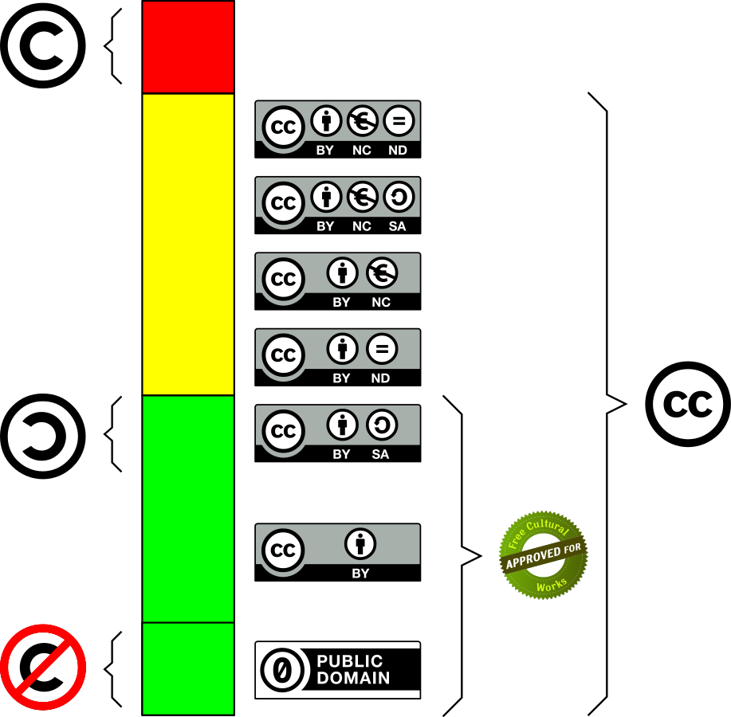

Aunado a ello, las formas de violencia a las que son sometidas las
personas son múltiples y complejas. Una apuesta política transformadora
tiene que permitir reconocer estas violencias y dar herramientas para
poder combatir. Queremos que todas podamos luchar.

Hay una diferencia abismal entre la violencia total, mutilante, hacia un
enemigo abstracto (los criminales, las drogas, "el enemigo") y el roce
propio del conflicto en la palabra, a través del habla y la escucha,
mucho más vital y espontáneo, donde somos cuerpos que resuenan, que se
transmiten. El problema es que nos enseñan que la violencia física, el
poder del Estado, es la única manera de lidiar con nuestras diferencias,
con nuestros deseos y con el desacuerdo. Para una transformación real,
tenemos que hacerle ingeniería inversa a la caja negra y tratar de
entender cómo se configuran las relaciones de poder y las reglas que dan
sentido al Estado. Vivimos en una era en la que, con internet, robots y
un sinfín de tecnologías, es técnicamente posible hacerlo. Se trata de
permitir que todas las personas seamos co-creadoras de la realidad, que
seamos potentes.

### Wikipolítica, ¿partido?

En 2018, Wikipolítica apostó todo por ocupar el Poder Legislativo en
diversos estados de la República mexicana. Si bien no negamos que este
es un paso necesario para proyectos de cabildeo estratégico, al no tener
una visión de largo plazo, es decir, un programa de gobierno, nuestro
experimento creó una red de voluntarias para salir calle a costa de
reproducir las mismas dinámicas de explotación que cualquier trabajo o
forma de activismo tradicional. Nos encontramos frente a un problema muy
grave porque la energía de todas las personas decayó con nuestra
terrible derrota en la contienda.

Frente a ello, la respuesta de algunas personas ha sido iniciar otro
aparatoso e incierto proceso para crear un partido electoral.
Desafortunadamente, el contexto del país es apremiante y la burocracia
electoral es un camino de picar piedra. Vivimos una guerra que ha dejado
cientos de miles de personas muertas y desaparecidas. Esto nos obliga a
pensar en una alternativa radical al modelo extractivista, dependiente
de los capitales financieros internacionales. Para muchas de nosotras
esta guerra es invisible, pues, en efecto, es difícil reconocer que
vivimos en una guerra por la fortuna de vivir en zonas seguras que están
lejos de las huellas de la pobreza y la miseria, ya sea en otro país, en
otra ciudad o simplemente en otro barrio. Nuestra incapacidad de verlo
no significa que la crisis sistemática de derechos humanos, el
exterminio feminicida, el auge del totalitarismo tradicionalista y el
creciente poder de los capitales extranjeros no exista o vaya a terminar
por sí solo.

La situación de nuestro país nos coloca frente a un problema de
asimetrías de poder muy claro. Aunado a eso, desde 2016 este país se
encuentra en un estado de excepción. El despliegue y la militarización
de las fuerzas del orden tienen como propósito hacerse del control
territorial que el narco ha arrebatado al Estado mexicano, pero también
para identificar, vigilar y repeler con hostilidad mortal a quien se
oponga a los reptiles que pagan a las corporaciones armadas para velar
por sus intereses.

<figure id="fig:reptilianos">

<figcaption>Reptilianos conspirando. Mira “Lo malo del capitalismo” en
ContraPoints de YouTube.</figcaption>
</figure>

Ya, en serio, los reptilianos quizá no sean lagartos, pero sí agentes de
la utilidad, del plusvalor, es el 1 % que siempre están buscando
especular con su dinero para generar más dinero, a costa de quien sea y
de cualquier daño al ambiente.

Volviendo al tema, la idea de un Partido meramente electoral es poco
eficiente y bastante proclive al corporativismo patriarcal. Muchos
machos adeptos a la disciplina del Partido hegemónico son también
virilistas, amantes de la disciplina y el sometimiento al falo (al
sacerdote, al patriarca), de la camaradería *buenaondita* que
invisibiliza las incapacidades de quienes asumen el papel de soldado
raso en un ejército de activistas. Como si de la disciplina y el control
fuese posible producir otra cosa que no sea represión y esquizofrenia.

La historia no tiene un motor y cada cambio lleva consigo una posición
sobre el presente, sobre el ahora. Lo único que nos permite creer en
nuestra posición como *La Partida* es la tecnocrítica, que significa que
a cada instante nos cuestionamos cómo hacer cosas efectivas. Recuerden
que la pregunta que nos hace pensar en el porvenir es como nos
organizamos estratégicamente sobre los problemas estructurales que
originan más formas de violencia. Si no pensamos así, seguimos en una
cultura de la inmediatez que niega la magnitud y complejidad del
problema, que sigue la corriente de los medios de señalar que no hay
alternativas sistemáticas que nos muestren imágenes de otra sociedad.

Nos encanta la posición feminista que no encuentra sentido en la necedad
electoral y en el deseo de Estado que late en la representación
política. Nos parece que más allá de conquistar la hegemonía sobre
**un** sentido común, se trata de crear canales por donde naveguen ríos
de una multiplicidad de sentidos. Para nosotras, se trata de ir más allá
de la vieja dicotomía izquierda y derecha. No queremos representar a
nadie, ni gobernar, pero sí que nos preocupa la representación y el
gobierno. Queremos que la gente recupere su propia voz, que ella misma
pueda defender sus batallas, no queremos más paternalismos. Compartimos
la lucha de la gente que pugna por una libertad radical, queremos dar
voz, pero no partimos del dolor, partimos de la alegría y de la
tecnocrítica como fe práctica, como creencia en la acción. Queremos que
la gente pueda gobernarse maximizando la eficiencia de sus recursos y
brindándoles nuevas herramientas. Sentimos que se trata de reiniciar los
símbolos culturales que existen alrededor de las herramientas que nos
permiten gestionarnos. A lo largo de estos años, nos hemos dado cuenta
de que es muy probable que las cosas que se te ocurran para hacer un
cambio suenen demasiado obvias, o sean muy difíciles, o ya existan. En
ese sentido, creemos que la tarea está en descubrir cómo hacerlas
fáciles o que, si existen, sean conocidas por la gente que quieres que
lo conozca, es decir, en crear una práctica de *mainstreaming politics*
(políticas sobre canales masivos).[^2]

### ¿Qué tan efectivo es el activismo?

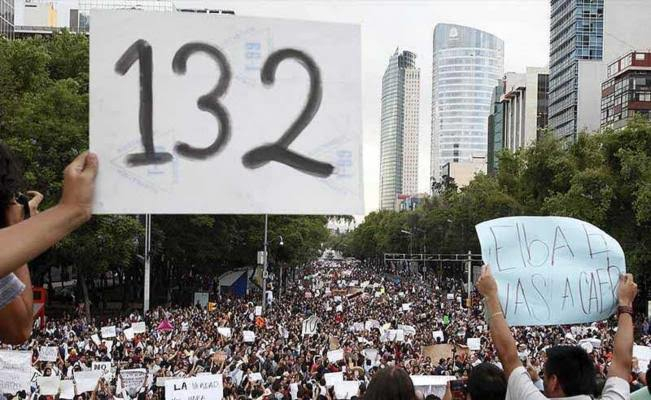

Los análisis de muchos activistas intelectuales de izquierda presuponen
conspiraciones globales elaboradas, como si la estupidez global
contemporánea fuera algo planeado. Ni siquiera los reptilianos en sus
reuniones en Davos piensan en controlar al mundo. La modernidad es un
discurso al cual aferrarse cuando en verdad el Medioevo nunca acabó. La
aristocracia, la burguesía, la gente en el poder, son solo idiotas a
quienes les gusta tener pisos de mármol, comer en restaurantes caros,
vestir ropas caras y mirar sus números crecer.

> La verdadera tragedia del presente es lo que alguien llamaba la
> *banalidad del mal*.

Mientras, nosotras vemos que el problema más grave que enfrentan las
resistencias de calle es *articularse* con otros esfuerzos. Muchas redes
de movimientos de base, de activistas defensores de DD. HH., etc.,
tienen que trabajar con la sociedad civil, otra casta de aristoburguesía
que actúa desde una clase privilegiada. Aunque no lo parezca, incluso en
las resistencias pervive la lucha de clases.

A veces parece que entre las personas activas políticamente prevalece
una atmósfera de rectitud moral, como si fuera evidente que lo que están
haciendo para tratar de cambiar el estado de las cosas es lo correcto.
En términos prácticos, resulta poco atinado querer imponernos frente a
la gente, tomar nuestra visión política como algo evidente, con un
vocabulario cerrado, cuando es una cosmovisión de clase (es decir,
condicionada por nuestros hábitos de consumo y poder adquisitivo). La
lucha es más eficiente entre más aprendemos a compartir, a socializar, a
hacer un ejercicio mayéutico que le permita a la banda darse cuenta por
ella misma de lo que quieres hacerle ver.

En este sentido, la militancia requiere aprender a escuchar a las
personas para tener una aproximación más o menos clara de sus creencias
para entender que la persuasión está en la apertura misma al diálogo.
Después de todo, la libertad solo existe en el momento en que somos
capaces de tomar una decisión, y la lucha política es una decisión,
nunca es evidente. Para empatizar, una tiene que posicionarse con
ternura radical frente al otro. Hay que tener presente que las cosas que
otras personas hacen tienen sentido de algún modo, al menos para ellas.
En pocas palabras, no hay ninguna forma de vida que sea intrínsecamente
más valiosa que otra. La clave está en reconocer los afectos como parte
de la racionalidad política.

Mientras tanto, las personas afines al liberalismo (a la *buenaonda*, a
la omisión del conflicto, a quienes reconocen que la única posibilidad
es institucional) se retuercen frente a un momento de posverdad y de
noticias falsas. No se explican qué llevó al mundo a semejante
"irracionalidad", no entienden que jamás la hubo y que los síntomas
contemporáneos son también una oportunidad de crear un nuevo horizonte
político. En medio de la crisis que vivimos diariamente, nuestra
experiencia de la realidad como flujos de información (*enlaces, chats,
shares*...) nos da una capacidad que antes era imposible, para producir
efectos en el mundo. Pero nuestra generación sufre porque somos
conscientes del cinismo ilustrado que prevalece en el espíritu
universitario, ya que sabemos que tenemos el potencial técnico para
vivir un mundo abierto, libre, pero no sabemos cómo (¿o realmente no
queremos?) crearlo.

Nuestra visión de la estrategia simpatiza con una corriente conocida
como xenofeminismo interseccional y considera que las subjetividades
están atravesadas por el género y por otras categorías que causan
opresión en distintas dimensiones. La novedad radica en concebir estas
categorías como dispositivos, es decir, como tecnologías que han sido
diseñadas por alguien con fines en particular. El costo de nuestros
fracasos al momento de actuar políticamente no es solo organizacional.
Se trata, ni más ni menos, que de una complicidad con el deterioro
ecológico y la violencia interseccional (cuyo punto de culminación es la
muerte) sobre las formas de vida, además del perfeccionamiento incesante
y los procesos interactivos del parásito capitalista.

### El cinismo es otra estrategia

Hemos visto con tristeza que muchos movimientos políticos cargan con la
melancolía de los vencidos, un estado de ánimo muy común a las
izquierdas. Los hombres que lideran usualmente dan la apariencia del
príncipe bucólico y carismático, como arquetipos del Che Guevara o de
otros guerrilleros revolucionarios. A veces parece que el folclore que
forman entre los grupos obedece más a su necesidad de sentirse abrazados
por una comunidad de seguidores, a su incapacidad de superar sus traumas
familiares o simplemente a cosas muy básicas como impulsos de
destrucción o de tener sexo. Hemos visto muy pocas personas con un deseo
genuino de crear una alternativa real, de actuar estratégicamente. Como
lo vemos, los líderes machos se entregan al cinismo porque les es más
cómodo usar la razón como instrumento para su beneficio. Estas personas
se convierten en ideólogas, argumentan siempre en favor de lo que les
conviene. Su postura es anacrónica, es decir, que no considera la
evolución histórica ni las coyunturas que dan forma a las sociedades a
través del tiempo, mucho menos considera que vivimos en una sociedad
extremadamente compleja donde el capitalismo se manifiesta a través de
algoritmos e instrucciones programadas en los comportamientos de las
personas. Hay una estrecha relación entre esta posición de comodidad, de
desvarío y de hipocresía irónica, y la crisis de fe contemporánea que
hay que enfrentar para poder construir una alternativa. Por supuesto, el
cínico reprimirá estos síntomas para seguir gozando de los beneficios
materiales de hacerse pendejo, al costo de invisibilizar un montón de
normas violentas necesarias para afirmar su identidad de macho
ilustrado. Pero su posición significa varias cosas.

> Nota mental: *El patriarcado no tiene género*.

Por una parte, es la muestra de que vivimos un profundo vacío espiritual
que necesitamos entender a través de sus síntomas para lograr crear una
alternativa a la religión del Yo. Así como la teología de la liberación
sirvió en su momento para la articulación política de subjetividades
despojadas de su tierra, hoy necesitamos crear una nueva teología pop
que haga frente a la falsa conciencia ilustrada contemporánea, que
plantee un horizonte hacia la libertad a través de diferentes visiones
religiosas, traduciendo ideas a través de significantes equivalentes.

<figure id="fig:century">
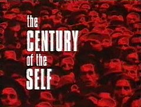
<figcaption>El documental <em>The Century of the Self</em> de Adam
Curtis trata sobre cómo nació esa religión del yo.</figcaption>
</figure>

Por otro lado, el peligro de estos hombres representantes es que su
aliento heroico parece ignorar que vivimos en una guerra y que es
absolutamente imprescindible tomar posición por acciones estratégicas
que ataquen transversalmente varios problemas. Necesitamos entender que
la evolución del capitalismo de "modo de producción" a "modo de consumo"
y el paradigma de informatización de la economía, rompieron con la
articulación de movimientos de clase, al estructurar la sociedad de tal
modo que la identidad se configura a través de las mercancías consumidas
y no de los vínculos afectivos entre personas. Accionar hoy requiere ser
consciente de la lógica de la dominación contemporánea y no solo de las
instancias tradicionales de incidencia.

#### *La verdad* es un instrumento

> Hoy parece más fácil imaginar el fin del mundo que el fin del
> capitalismo.\
> *Fredric Jameson*.

El mundo no se acaba, se acaban las sociedades. Específicamente, se
acaban quienes padecen las sociedades. Se acaba el hábitat de quienes
solo tienen la tierra. La ecocatástrofe es la tragedia del exterminio de
quienes viven en el margen, en las periferias. No es una lucha por la
conservación del planeta, sino por la vida de quienes padecen los
residuos contaminantes del capitalismo. En medio de esta ecocatástrofe,
la noción de *verdad* tiene sentido para pensar en cómo se configura la
memoria y la validez de los argumentos para un grupo de personas en
particular. La verdad es el filtro con el que se mira, aquello que se
considera valioso. Está relacionada con el recuerdo y está mediada a
través del lenguaje, que articula nuestras experiencias en imágenes. La
verdad siempre es a través de un observador, la verdad nunca está en el
acto. En el acto hay presencia, realidad.

<figure>

<figcaption>Anuncio sin filtro. De Slavoj Žižek en el documental “The
Pervert’s Guide to Ideology”</figcaption>
</figure>

<figure>
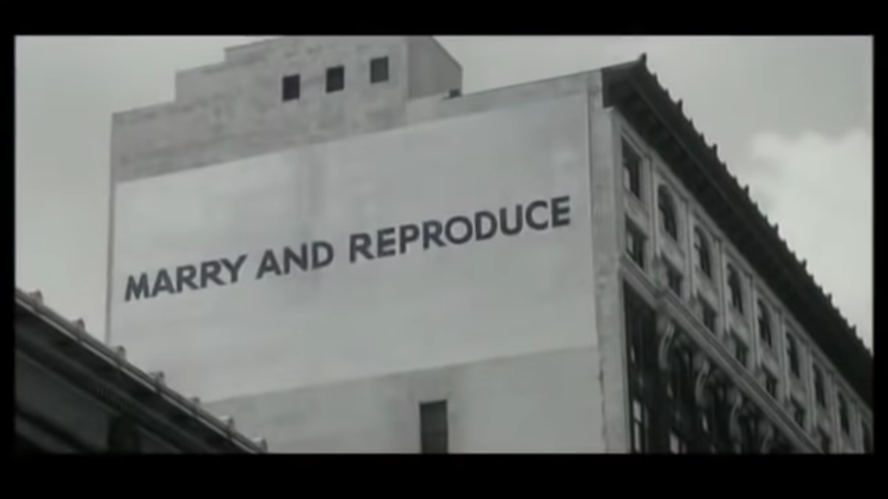
<figcaption>Anuncio con filtro. De Slavoj Žižek en el documental “The
Pervert’s Guide to Ideology”</figcaption>
</figure>

La noción de "conocimiento" proviene de una tradición de pensamiento que
ignora otro tipo de *saberes*, como la sensibilidad artística, la
salud[^3] o la relación con la tierra, la memoria y la conciencia sobre
el territorio. Una militancia crítica, efectiva y consciente requiere la
capacidad de comprender cómo se configuran los procesos históricos,
testimonios y experiencias, de personas que hablan desde el lugar que
habitan y cómo esa relación configura una identidad, no desde la
historia oficial, de sucesiones de reyes y héroes grandiosos. Para
lograrlo, es necesario renunciar a las pretensiones de verdad absoluta y
a la culpa producida por la cultura del *deber ser*. No hay una verdad
por la cual luchar, hay verdades situadas según intereses. La
tecnociencia es una herramienta transformadora, que puede servir para
terminar con la escasez de alimento, tanto como para perfeccionar un
ejército. Es necesario asumir una posición en la que nada es evidente y
todo acontece en la apariencia, obligándonos a estar atentas a nuestros
juicios. El xenofeminismo nos permitió bosquejarlo como algo parecido a
una pedagogía de la complejidad del mundo, que requiere una actitud casi
estoica, contemplativa, de aceptación que hay que tener frente al mundo,
como una postura de diálogo con la alteridad, con todo aquello que no es
lo que creemos que somos nosotras individualmente.

La derecha alternativa (*alt-right*) ha sabido bien utilizar la verdad
como un arma. Dentro de este movimiento se critica mucho la idea de que
la izquierda vive en una Catedral, haciendo alusión a una política
dogmática y sectaria. Sabemos que esta postura no es otra cosa sino el
partido del resentimiento total, pero son, al mismo tiempo, tan básicos
que nos han dado una buena idea, la de crear espacios como las Iglesias
lo son para sus adeptos, pero para que las personas podamos hablar con
libertad y recuperar vínculos entre nosotras. Si la derecha se vale de
artimañas pos-ideológicas y adopta posturas económicas de la
socialdemocracia keynesiana, nada nos impide reconocer que la
justificación sobre el uso de determinada estrategia se construye
después de que se ha obtenido una victoria. Por eso, si no pensamos en
abrir las élites, en infiltrarnos, nuestro poder se verá reducido cada
vez más. Las élites detentan el dominio material frente a los oprimidos
a través de tecnologías como los códigos culturales del género, la raza
o la clase. Sabemos que otras resistencias de izquierda más radical no
han podido mantener un impacto, pero sí tecnologías de lucha avanzadas,
como procesos, metodologías y códigos de programación que han resultado
de distintas luchas de autogestión. No subestimemos sus esfuerzos.
Estamos aquí porque hubo un Atenco, hubo una *otra campaña*, hubo un
Syriza. Esas luchas tienen que lidiar con el enemigo, quien en todo
momento busca despojarle de su terreno, del patrimonio natural o de la
vida misma. Ellas nos han enseñado que la autogestión no significa
informalidad. Significa comprometernos a cultivar y entrelazar los
saberes necesarios para que la gente pueda organizarse autónomamente con
sus locales, con quienes comparte una vida común.

Sin embargo, la velocidad con la que la catástrofe ambiental y el cambio
de lógicas de segregación a lógicas de gentrificación como forma de
exterminio, devoran cada espacio donde es posible vivir, nos obliga a
desarrollar tecnologías a gran escala que permitan conectar las
resistencias locales a plataformas globales, con el propósito de atacar
transversalmente estos problemas. Por ello creemos en una política de
muchos frentes, multilateral, estoica y pragmática. Desde la izquierda y
la derecha, desde arriba y desde abajo.

Hay que recordar, sin embargo, que muchas resistencias provienen de
organización popular frente a los desplazamientos forzados por
megaproyectos y otras imposiciones estatales. Frente a estas
necesidades, es prioritario que pensemos el activismo político, tratando
de articular proyectos, siempre desde el territorio, creando vínculos
comunes con gente que comparte agendas, o fungiendo como líderes
comunitarias para resolver algún problema en común con los vecinos. Es
decir, crear una base social de simpatizantes a través de la
participación real en la comunidad. Una buena forma de hacer esto es,
por ejemplo, analizando el código (los memes) que configuran una
experiencia concreta de lo real para un grupo de personas y crear
imágenes que la gente haga suyas sobre cómo organizarse, cómo participar
desde su circunstancia particular, partiendo de comprender las
motivaciones y necesidades de las personas. Saul Alinsky, un organizador
comunitario muy importante en Estados Unidos durante la primera mitad
del siglo XX, insiste en tener una ética basada en principios
interpretables, no universales sino en tensión. A grandes rasgos, esto
significa jugar un rol de mediador a través del reconocimiento de las
diferencias y con entrenamiento para crear consensos y resolver
disputas. Pero, sobre todo, reconocer que el *trabajo* y la forma en que
*deseamos* son cuestiones clave para encontrar una alternativa a la
crisis.

### Un trabajo político efectivo

En términos concretos, necesitamos aprender a trabajar en calidad de
iguales, a escucharnos y a delegar. La tarea es compleja y requiere
acciones multidimensionales, desde distintos frentes. Por ejemplo,
frente al panorama mundial, necesitamos dialogar con distintos
movimientos alrededor del planeta, desarrollar una política
internacional que podamos empujar y difundir en la opinión pública,
abrir líneas de estudio y tender puentes con los diferentes sectores con
los que estemos presentes. No necesitamos ser protagonistas de la lucha,
como lo demandaría la ideología de la representación política, sólo
crear las condiciones de posibilidad para que suceda. A esto nos
referimos con la idea de abrir espacios para que todas podamos
ocuparlos. Tenemos que ser estratégicas y usar con precisión
herramientas de redes sociales pensando en hacer sexy el
activismo/militancia política para más personas. Estas cuestiones nos
abren preguntas de comunicación y mercadotecnia como:

-   ¿cómo nos diseminamos estratégicamente?

-   ¿con quién queremos crear lazos?

-   ¿cómo nos hacemos visibles para otras simpatizantes?

En función de nuestra capacidad de acercarnos a la gente que nos
apoyaría, podemos encontrar alternativas de financiamiento, como la
creación de un ecosistema de cooperativas donde las personas puedan ser
consumidoras y productoras. Para lograrlo, podemos hacer labor política
en nuestras redes para identificar prácticas y proyectos útiles, como
los de sistematización de metodologías de organización o lo que ayude a
que todo sea más democrático y eficiente.

La cuestión está en tratar de que todo lo común a nosotras (espacios,
recursos, expresiones) tengan mecanismos efectivos de implementación
local, que cualquier persona pueda acceder a nuestros recursos y
organizarse. Esto es posible con una pedagogía de organización personal
y comunitaria a partir de hábitos y prácticas. No se trata de compartir
un canon ilustrado, sino de descubrirse como manifestaciones concretas
de la humanidad y trabajar entre todas para vivir alegres. Para ello
tenemos que plantear del principio de que las organizaciones se planean
y diseñan desde sus usuarias y desde sus operadoras. Esto significa que
nuestros procesos también deben estar diseñados para *nosotras, las
personas* que los operamos. Con la intención de ser siempre una
organización diseñada para la hospitalidad, para atraer la atención de
todo el mundo y poder acercarle una vía para interactuar con la
organización y participar políticamente desde su circunstancia.

<figure id="fig:decidim">

<figcaption>Un ejemplo de formas de organización social y el aporte del
proyecto Decidim.</figcaption>
</figure>

También necesitamos procedimientos de creación colectiva.[^4] Crear
dinámicas, herramientas y saberes comunes, además de hacer un
reconocimiento explícito de posturas ideológicas para que cada grupo
pueda desarrollar su agenda y así crear un plan de trabajo global donde
cada representación temática se encargue de desarrollar su agenda. En
este sentido, vemos al liderazgo como encuentro y mediación que necesita
que desarrollemos tecnologías de la presencia para diseñar espacios
donde se pueda gestionar adecuadamente el conflicto. Se trata de
construir desde nuestras diferencias y no a pesar de ellas, de reconocer
que los qués se resuelven en los cómos, es decir, que los grandes
conceptos abstractos se vuelven tangibles a partir de los detalles de
implementación. Hay tribus donde los jefes de tribu son únicamente las
personas que consultan y toda su autoridad se basa en opinar la manera
más acertada de hacer algo sobre lo que deciden, en concreto las
personas que saben cómo hacerlo. Sería bueno que cada persona que
integra una organización supiera un conjunto de habilidades mínimas,
como liderazgo, comunicación, gestión del trabajo o programación, para
poder crear equipos realmente transdiciplinarios ajenos a la necesidad
de tener la razón, de tener *la verdad*.

### ¿Cómo crear una alternativa?

El deseo de Estado es realmente el problema que más nos preocupa, por
eso pensamos que la crisis de nuestro tiempo es una crisis de la imagen.
A grandes rasgos, el deseo opera como una respuesta activa de nuestra
psique a la impresión que las imágenes producen en nuestros cuerpos. El
Estado reproduce el Patriarcado y funciona de maneras muy sutiles,
desarrollando tecnologías que transforman nuestro deseo en un canal para
la transmisión de mercancías, para que nuestras respuestas sexuales sean
capitalizables como grandes masas de tráfico de información. Si la
sensibilidad ha sido durante mucho tiempo una mera disposición pasiva al
sufrimiento, ahora tiene que volverse el medio mismo del combate, ser
una ciencia de la transmisión de imágenes y del hackeo de significados,
ser la ciencia de los memes. El arte político de redirigir el
sufrimiento en fuerza, el odio hacia uno mismo y los impulsos de
autosabotaje en rabia hacia las normas impuestas por el mundo exterior,
y la desesperanza en coraje para luchar por seguirnos encontrando y
construyendo, aunque a veces sea difícil. Tenemos que aprender a
reconocer nuestros deseos y a hackear el resentimiento de clase,[^5] así
como darnos cuenta de nuestros privilegios y de la importancia de
nuestra historia y de nuestra clase para la organización política.

La maquinaria estatal se encarga de orientar todas nuestras voluntades a
proyectos que sirvan para construir un orden donde todas las personas
son ciudadanas, sí, pero también son soldadas, consumidoras y
espectadoras de lo que es producido como lo real. Necesitamos pensar el
modo de generar un sentimiento de creación que no se sienta como el
sentimiento de los débiles de la izquierda, que no se sienta como
revolución permanente sino como un mundo nuevo que surge de las cenizas,
pero no tiene el martirio de la filosofía existencialista porque es un
sentir comunitario, pues no tiene la característica del abandono que
veían esos filósofos individualistas, un mundo que está vivo y presente,
alegre.

Una verdadera alternativa es la creación de un nuevo poder, de comenzar
a construir un mundo donde efectivamente quepan muchos mundos. Desde el
contexto político latinoamericano, la construcción de un proyecto de
país es parte de lo que llamamos *poder constituyente*, una articulación
política para un nuevo contrato social. Una coalición de fuerzas
progresistas para una agenda de innovación estratégica cuyo fin sea
hacer efectivo el buen vivir o bienestar para todas las personas. Esta
multitud se articularía alrededor de agendas, sectores y esferas de
acción basadas en recursos comunes y en la visión FLOS (*free, libre and
open sources*), un concepto que desarrollaremos más adelante. Esto
significa desarrollar una base social a través de una plataforma que
permita que la gente se organice, un imaginario común del futuro y un
repositorio de tecnologías que permitan a la gente *saber hacer*.

## Lee esto antes de *hacer* algo

El nuestro es un mundo de redes, navegable a través de teorías de la
complejidad y del caos. Muchos procesos automáticos alimentan
diariamente el flujo de operaciones de las infraestructuras (redes de
abasto de combustibles, electricidad para servidores, satélites, líneas
de internet) sin que haya realmente un responsable. Las funciones están
programadas y los destinos predeterminados. Miles de variables
interactuando entre ellas a partir de distintos nodos que envían
información diversa y que demandan u ofertan certificados, *requests*.
La idea de la cibernética es dispersar para crear un caos gestionable,
incluso automatizable.

<!--  -->

Al mismo tiempo, tenemos lo necesario para implementar una economía
*postescasez*,[^6] sólo se trata de intervenir estratégicamente en esas
redes de información, que también son flujos de sentido, producciones de
deseo. La utopía robótica es una de las aristas de distintos escenarios
posibles planteados por el texto de Peter Frese titulado *Four Futures*,
donde señala que viviremos en un mundo materialmente condicionado por
dos aristas, una de igualitarismo-estamentalismo (o sea, donde las
jerarquías manden) y otra de abundancia (por la automatización
tecnológica) o escasez (por nuevas formas de los patrones para crear
valor explotable). De esos casos, los más extremos parecen ser el mundo
donde quepan todos los mundos, sostenido por una infraestructura
tecnológica común, y el exterminio, que es prácticamente lo mismo, pero
solo para el 1 % de la población global.[^7]

|             |**Abundancia**|**Escasez** |
|-------------|--------------|------------|
|**Igualdad** |Comunismo     |Socialismo  |
|**Jerarquía**|Rentismo      |Exterminismo|

Según Natalie Wynn[^8], la derecha de internet pinta una caricatura de
la izquierda, con el marxismo posmoderno como la supuesta ideología.
Esto es muestra de que una de las operaciones más efectivas del parásito
capitalista es poner a pelear a las resistencias en torno a cosas
pequeñas y concretas,[^9] cuando es más aquello en lo que estamos de
acuerdo pero tenemos la necesidad de encontrar coherencia teórica en
modelos ideales y no en especulaciones sobre la realidad. Esta posición
que renuncia a la necesidad de certidumbre intelectual ---es decir, que
no va más allá de una pregunta sobre instancias, sobre cómos--- se
conoce como realismo especulativo y es cercana a una teoría del
conocimiento (y filosofía del ser) llamada "ontología orientada a
objetos". Es importante recordar que probablemente las civilizaciones
humanas han sido injustas desde el principio de los tiempos, pero la
posición que tomamos respecto a la explotación de los patrones, de los
propietarios o de los banqueros depende en buena medida de dónde estamos
paradas.

Como reza el lema del xenofeminismo:

> Si la naturaleza es injusta, ¡cambiémosla!

Podemos hablar desde el arte, generando consensos en torno a acciones
comunes en distintos grupos. A veces parece más fácil actuar desde los
medios que desde la militancia de izquierda. Nuestras aliadas han
repetido ya varias veces la necesidad de hacer un posicionamiento
estético sobre el discurso. En nuestros tiempos, en la política rige el
principio de que fondo es forma. Y sin embargo, son las cuestiones
estructurales como el género, el color de piel, la nacionalidad, el
acceso a educación, salud, el dinero, etc, las que más afectan, por una
cuestión de origen, de diseño, sobre las tecnologías que configuran
nuestra realidad.

Al ser un concepto y no el nombre de un objeto concreto, la influencia
del capitalismo se toma por la derecha como un mero principio económico
que brinda todas las mercancías necesarias para vivir cómodo. He aquí
una de las partes más importantes del problema. Para entenderlo, tenemos
que comprender las diferencias entre Estado y Capitalismo en la
historia, y cómo funciona a grandes rasgos el espectro político a partir
de estas diferencias. Sin embargo, el pensamiento del *status quo* es
realmente poderoso pues el Estado dispone de manera muy particular de
las armas que reproducen el modo de producción capitalista, las orienta
siempre a la eficiencia y optimización que produce valor intercambiable.

### ¿El enemigo es el capitalismo, el Estado o los mercados?

Ahora vamos a profundizar en algunas distinciones que sirvan para hacer
cosas que generen cambios reales. Sabemos que en este análisis hemos
hablado poco del patriarcado, pues lo asumimos como parte de la
ideología primigenia del capitalismo. Ponga usted mucha atención porque
ahí vamos:

El capitalismo, desde una *visión de ingeniero*, se trata básicamente de
un modo de producción de bienes materiales. Este modo de hacer cosas
parte de factores de producción que tradicionalmente han sido resumidos
como tierra, capital y trabajo. El marxismo fue importante porque nos
mostró un análisis mucho más extenso del capitalismo, al entenderlo como
una configuración de las relaciones sociales a través de los procesos
productivos, donde las mercancías tienen un valor por sí mismo y tan
poderoso que configuran la identidad misma de las subjetividades.

Para nosotras, además de lo que le aprendimos al marxismo clásico, el
capitalismo es un modo de producción, pero en este momento de la
historia también es una *velocidad sobre los flujos de información*.
Para sostener lo anterior, es necesario que comprendamos que el viejo
escenario económico donde la fábrica jugaba el rol predominante en la
producción de valor ha sido reemplazado por una lógica de trabajo que
pulveriza y divide en diferentes espacios la línea de producción, de
manera que sea más eficiente y barato producir. Y lo que genera más
valor en la economía contemporánea no es ya la mercancía como un objeto
físico, sino la información que producen las relaciones entre las cosas.
A esta era de la economía algunas personas la llaman *posfordismo*, y
entre otras cosas, es más una forma de producción regida por el consumo,
es decir, la demanda de bienes, que por la producción, como lo fue en
las revoluciones tecnológicas pasadas.

El mercado es un conjunto de transacciones. Es la infraestructura del
intercambio mercantil y su acontecer capitalista tiene más que ver más
con el cobro del impuesto, origen de la financiarización del valor,[^10]
que con el comercio. El capitalismo es un parásito cultural que paraliza
el trabajo y subsume los recursos y hábitats del planeta mientras
mercantiliza bienes primarios (*raw materials*) en abstracciones
virtuales, a través de una economía del deseo. Se in-corpora (es decir,
configura una respuesta física, corporal) en las relaciones de las
personas y crece sin límites hasta que mata al huésped. Además, es
contagioso. Se ajusta a afectos y deseos de los huéspedes, mientras que
se adapta a esa lógica en particular. Su funcionamiento produce un
ecosistema. Imagina que además de una configuración sobre las
velocidades, el capitalismo es un parásito que infecta los grupos
sociales, una suerte de falla en la naturaleza que nos impide
relacionarnos directamente.[^11] El propósito de este parásito es
acumular cada vez más. La inteligencia del parásito reproduce la lógica
de un virus informático. Es decir, hoy en día el capitalismo como
parásito vivo es concretamente un algoritmo. Si la sociedad funciona
como un sistema vivo, el capitalismo es el virus que infecta las
relaciones sociales para convertirlas en relaciones mercantiles, con la
única intención de mantenerse como necesario. En ese sentido, juega un
rol parecido al Estado en la medida en que actúa como intermediario de
toda relación social. Sin embargo, si el mercado es el medio del
capital, *el Estado es el soporte de información del mercado*, es el
medio de almacenamiento y transmisión de la información del mercado que
no puede ser retenida en la contabilidad. El Estado es una expresión de
tecnologías del poder, con instancias materiales concretas. Más allá de
la ideología, el poder se despliega a través de un conjunto de
tecnologías.

El gobierno justifica la recaudación de impuestos al proveer servicios
que hasta el momento consideramos que los mercados no podrán proveer (en
buena medida por el control del capital). En términos de dinámicas de
toma de decisión, el Estado es la masa personificada o "agenciada", es
decir, una entidad que puede trabajar como un agente. De ahí la
necesidad de sistemas de recaudación en red que partan de una
reconfiguración de las subjetividades y, por tanto, de la comprensión de
lo público, lo privado y lo común.

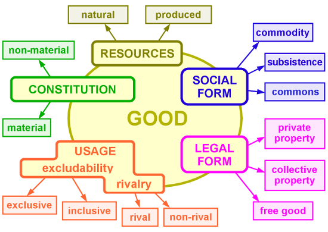

Volvamos a los factores de producción (tierra, capital y trabajo). El
capitalismo necesita disponer de cada uno de ellos de forma que permitan
producir más valor para generar más dinero y reproducir el ciclo de
acumulación. Ahora bien, para que esto ocurra, necesitamos algo que
muchas personas llaman contrato social, pero que nosotras preferimos
llamar "reglas del juego". Llamemos Estado a la entidad encargada de
hacer valer las reglas del juego capitalista a través de las
instituciones y de una maquinaria que garantice derechos de propiedad.
El Estado proporciona lo que podríamos llamar *aparato de captura* de
los factores de producción para el ciclo económico del capitalismo.

Este aparato de captura se compone de tres subjetividades principales:
el propietario (que posee la tierra), el banquero (que dispone del
capital) y el patrón (que explota el excedente del trabajo). Estas
personas (en su mayoría hombres, agentes directos de la estructura
social patriarcal del ciudadano) son las cómplices humanas del parásito
capitalista y se encargan de perpetuar su existencia garantizando la
base material de la producción capitalista. Es decir, son los
principales agentes vivos del capital y de su existencia depende
estructuralmente la supervivencia del algoritmo. Hemos sido
particularmente atentas en explicar estas cuestiones porque entre
diferentes posiciones de izquierda (desde marxistas hasta anarquistas,
pasando por feministas radicales y ecologistas) resulta extremadamente
complicado distinguir al Estado del capitalismo o del mercado, y no
podemos pensar en crear una fuerza política que produzca
transformaciones radicales sin que entendamos de qué manera se implican
estos sujetos en la configuración del estado actual de las cosas.

Hay una dimensión psicosexual de la producción, además de sus
componentes materiales, a través del deseo. Todas las mercancías son un
poco fetiches y actúan como mediadores sociales entre las personas. Las
mercancías reflejan lo que las produjo: trabajo y deseo. La relación
entre el parásito (capitalismo) y el Estado es simbiótica y no
parasitaria. El Imperio es la forma que toma el Estado cuando el
parásito muta de la fábrica al algoritmo. El parásito requiere al Estado
para garantizar los derechos de propiedad de sus propios agentes.[^12]
Estos sujetos son los traficantes de medios de producción y configuran
el aparato de captura del Estado (lo que en una configuración urbana
serían los muros o en una cárcel las cadenas). La forma algorítmica del
parásito, a diferencia de siglos pasados, no reprime ni suprime más el
deseo, sino que lo recodifica y se deposita en él. Sin embargo, la
mutación del capitalismo produce fluctuaciones en el mercado, creando
ciclos económicos donde el parásito es más fuerte pero también donde
toca fonda antes de volver a mutar.

<figure id="fig:algoritmo">

<figcaption>El algoritmo virulento del capitalismo y sus conspiradores
humanos.</figcaption>
</figure>

El parásito infecta a las personas a través de mercancías que producen
interacciones sociales a través del intercambio. La persona asalariada,
trabajadora, accede a intercambiar su fuerza de trabajo física,
intelectual, sexual o la que sea, por la potencia abstracta del dinero y
este por un objeto valorado socialmente que transforma la abstracción
del dinero en reputación o prestigio, con el trasfondo del miedo a ser
rechazada, a estar fuera del *socius* si una no reproduce la transacción
constantemente. De ese modo es que el capitalismo produce subjetividades
a partir de la explotación de las trabajadoras, que en realidad no
tienen una conexión real con lo que producen. En todo el planeta, aunque
a diferentes escalas, esta forma de organización social produce al
Gobierno y a sus súbditos: subjetividades caracterizadas por la fórmula
*ciudadano-soldado-consumidor-espectador*.

No hay posibilidad de una ciudadanía tal y como se concibe hoy en día al
concepto dentro de los Estados liberales democráticos. La subjetividad
del ciudadano (soldado, consumidor y espectador) presupone condiciones
de clase, etnia y género muy particulares que básicamente se reduce al
Señor blanco, heterosexual y cisgénero, que posee propiedades, es patrón
de alguien y tiene acceso al crédito y a instrumentos más complejos en
el sistema financiero. Además de que esta subjetividad plantea una
relación con el cuerpo propio que niega su propia castración,[^13] hace
creer a la forma de vida que las otras personas son lienzos donde se
dibujan sus fantasías frente a otras subjetividades pauperizadas que,
entre todas, están construidas para satisfacer los deseos del Señor
(¡sí, del Señor feudal, de tu papá y del señor patrón, y del señor de la
casa y del Señor que reina en los Cielos, la palabra *Señor* tiene toda
esa semántica en tu cabeza!). Entender la realidad de ese modo, y en
consecuencia, la Naturaleza (y a Dios, y a la Ciencia, y al progreso),
solo reafirma el poder del Estado capitalista. Por ello, cualquier
movimiento político que pugne por *corregir al Estado* cuando este es la
falla misma, terminará por infectar de deseos señoriales a las formas de
vida que resisten a la subordinación del Espíritu que la sociedad
moderna produce.[^14] He ahí la complejidad de la práctica del cambio
real.

## Más allá del Estado moderno: el Imperio

Desde un punto de vista estratégico, la transformación del Estado moderno tras la consolidación del proyecto imperialista, es el Imperio. Esta forma se caracteriza por una pulverización del poder y un cambio en los modos de producción, donde se privilegian los procesos industriales pulverizados, sin fábricas ni obreros reunidos en un mismo espacio. El Imperio se caracteriza por el auge de entidades más allá de los Estados nación, como las empresas trasnacionales, que compran representantes políticos para legislar en favor de sus intereses. Aunado a lo anterior, la policía y la publicidad, mecanismos del Estado moderno, se transforman en el Biopoder y el Espectáculo.

El Biopoder consiste en el traslado del orden de La Ley a la regulación a través de normas sin sujeto, interiorizadas. Mientras, el Espectáculo consiste en la apropiación capitalista de la imagen para mercantilizar el deseo. Estos procesos maquínicos, que definen al Imperio como fase posterior al desarrollo e implosión de los Estados-nación, tiene distintos modos de regulación, que constituyen y dan forma a su aparato de captura:

-   Aparato socio-ideológico: familia, tradición, religión, nacionalidad, etc. Codifica el deseo y la colonización psicológica del sujeto, establece hegemonía además de producir y mantener el estado actual de las cosas.

-   Aparato productivo-comercial: finanzas, bancos, empresas corporativas, propietarios, etc. Comercialización de la producción, mercantilización del deseo para ligarlo al proceso de producción, monopolización del mercado, el valor de los desvíos que regresa a los ricos a través de la parasitación de la mano de obra.

-   Aparato marcial-carcelario: los militares, la policía, la inteligencia, el sistema de prisiones. Mantiene el estado actual de las cosas con la fuerza, la disciplina y el control de los sujetos; protege los intereses de los propietarios capitalistas y del Estado (sus fronteras), extrae recursos de otras regiones a través de la fuerza, redirige la riqueza para expandir el brazo militar del Estado e incentiva su investigación y desarrollo.

-   Aparato subversivo-periférico: subjetividades colonizadas, grupos minoritarios, organizaciones criminales, la banda en sombra (*shadow banking*), los mercados negros, etc. Muerte social y *necropolítica*. Establece la identidad de los ciudadanos mediante la otredad como diferenciación de subjetividades marginales, da un camino al lucro más allá del aparato comercial productivo.

-   Aparato legal de la soberanía: el Estado, el sistema de justicia, los gobiernos, etc. Colonización el espacio geofísico, establecimiento del territorio y determinación de estratos y jerarquías sociales.

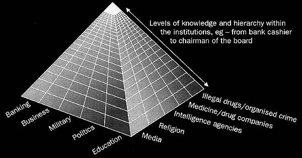

Si le damos una pensada más profunda y concreta, descubriremos que
detrás de cada uno de estos dispositivos existen entidades económicas
con transacciones y reglas del juego que regulan la vida social en
diferentes esferas, pero a dos escalas, una micro (corporal, que
corresponde al Biopoder y el Espectáculo) y macro (burocrática, de
legislación e infraestructura tecnológica). En principio, podríamos
hablar de las cinco grandes empresas que condicionan el desarrollo de
las telecomunicaciones: Amazon, Apple, Google, Microsoft y Facebook.
Estas son la base material por donde fluyen información y códigos
sociales, representaciones del mundo, que son reproducidas en los
dispositivos personales para provocar una reacción, un deseo. Esta nueva
forma del capital explota reacciones, capitaliza el placer que puede
cuantificar en *clics* y *shares*.

Este ciclo se basa en un delicado circuito de excitación, frustración y
excitación que regula los hábitos de consumo. Se trata del modelo ideal
de empresa neoliberal, un paradigma del negocio pos-industrial. La
pornografía es un régimen estético que produce significados y un modo de
presentación de las cosas que resulta adictivo, que permite obtener
satisfacción del placer masturbatorio sobre la representación de
cualquier fantasía posible materializada en videos.[^15] En los foros de
internet para varones adictos a la pornografía existe un nombre para el
circuito pornográfico que tiene atados a tantos hombres a una forma
particular de desear. Se conoce como: *Porn, Masturbation, Orgasm
(PMO)*.[^16] El malestar de estos hombres cada vez más incapaces de
vivir y en simbiosis con las comodidades del capitalismo que extienden
el poder de sus formas tristes de vivir a otras esferas sociales, son el
síntoma de este nuevo rostro de la economía. La excitación, la erección,
la eyaculación, el placer y el sentimiento de autocomplacencia y control
omnipotente se vuelven materias primas del proceso productivo.

Por esta razón, P. Preciado señala que la pornografía es el rostro
desenmascarado de la industria de la cultura y propone el concepto de
*farmacopornografía* para referirse al gobierno biomolecular y
semiótico-técnico de la subjetividad sexual. Hay, de hecho, empresas que
se encargan de regular la producción de contenidos excitantes que
funcionan como mercancías con estudios explotadores y personas
trabajadoras sexuales explotadas. La explotación mercantil del sexo es
paradigmática porque un solo video puede producir millones de
orgasmos,[^17] lo que contrasta con la industria farmacéutica, donde el
desarrollo de un medicamento cuesta muchísimo, pero es fácilmente
reproducible una vez que se obtiene y patenta una fórmula.

Así, las grandes entidades económicas capitalizan problemas clásicos de
la economía como las asimetrías de información, el problema de agencia o
los dilemas de acción colectiva. Además, condicionan nuestros deseos
imprimiendo en nuestras psiques imágenes de lo deseable, además de crear
una erística que nos enseña que esos estímulos que aprendemos a desear
los podemos obtener a través de la moneda, de intercambios mercantiles.
Estas empresas aprenden, a través de costosas investigaciones sobre el
comportamiento humano, para reproducir la servidumbre en los contenidos
a través de segmentos de mercado donde se puede insertar el discurso del
parásito capitalista bajo distintas situaciones y formas sexuales.
PornHub es el paradigma de la industria cultural por su capacidad para
producir orgasmos, para *gestionar el género, la excitación, la
frustración y el placer*. De este modelo de empresa se pueden extender
otras versiones *soft* (o blandas) que operan en otros aparatos
sociales. Disney como el dispositivo que reproduce el imaginario de la
jerarquía social a través de sus mitos de princesas, reyes y monstruos;
MacDonalds y Coca Cola para reproducir la *Resaltar en cursivas.*.[^18]

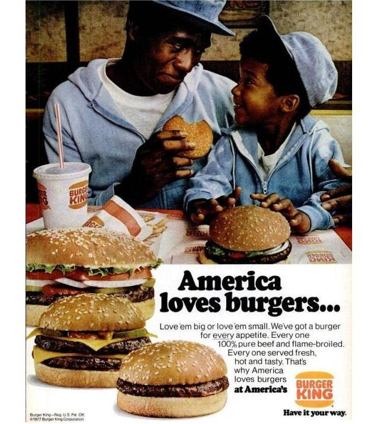

### La vida como trabajo y la producción de subjetividad

Un punto importante para comprender la transformación del Estado-nación
al Imperio se encuentra en el papel del trabajo. Por ello, en este
apartado analizaremos las condiciones de producción del trabajo del
hombre-masa en la era cibernética. Para comenzar, tenemos que recordar
que la dominación mercantil tiende a expandir sus dominios a toda área
de la vida y al hacerlo vuelve trabajo a cualquier acción sujeta de la
explotación. Este proceso está relacionado con la transformación de la
subjetividad. No por nada el concepto central de las revoluciones de los
siglos XIX y XX es la masa, una subjetividad que experimenta la realidad
de la misma manera, a través del *consumo estandarizado*. En este
proceso, las vivencias en su forma de experiencias cognitivas dan
sentido y estructura a la imaginación, es decir, a la máquina deseante
que es cada singularidad. Así se configura una idea del pasado (a través
de Hollywood que nos enseña a desear melancólica o espectacularmente) y
del futuro (el apocalipsis como una finalidad de la historia implícita
en las narrativas culturales a través del tecnocapitalismo, donde la
explotación se extiende a cada rincón del planeta, deja a su paso
desolación y muerte para después reconstruir la "sociedad") a través de
los medios que producen para las grandes audiencias.[^19]

En términos concretos, la masa es el resultado de un proceso sintético
en el que el individuo afronta una situación externa a él, participa en
la situación y proyecta la situación en otros individuos que habitan el
mismo espacio. Como ejemplo está Disney, que transmite efectivamente el
deseo de casta a través de sus figuras de princesas, reyes y caballeros.
Para profundizar sobre estos puntos conviene revisar los documentales de
Adam Curtis, particularmente recomendamos *The Century of the Self* y
*Hypernormalisation*.

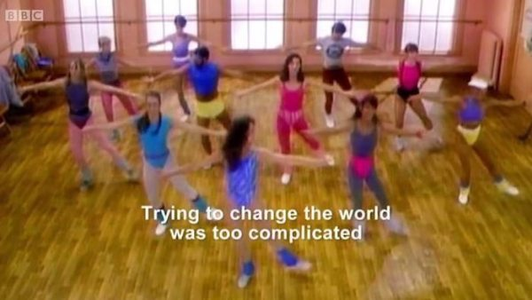

Nosotras hemos intentado perfilar a la subjetividad ideal del Estado
moderno como algo parecido al *ciudadano-soldado-consumidor-espectador.*
Solo basta recordar que el antecedente histórico del ciudadano han sido
los súbditos, los fieles. Quizá desde ahí se perfila el proceso donde
las multitudes devienen siempre masa a través de los aparatos de
captura. El lenguaje cotidiano es muy útil para hacernos ver cómo se
transmite la deuda en la subjetividad de
ciudadano-soldado-consumidor-espectador:

> paga tus impuestos\
> sirve a la patria\
> no te pierdas el descuento...\
> ni el siguiente show (la siguiente película).

En esta fórmula todas las personas deben. El deber y la deuda provienen
del mismo sentir (y de la misma locución latina *debere*). Sin embargo,
la deuda tiene una condición que ha sido entregada antes del nacimiento,
como una suerte de fruto por el que hay que pagar con el pecado original
durante el resto de nuestras vidas. El ciudadano *debe* pagar sus
impuestos, el soldado *debe* honrar a la Patria, el consumidor *debe*
comprar y el espectador *debe* mirar.

### Hoy en día, el capitalismo se comporta como un virus

El algoritmo del virus capitalista y el condicionamiento de desarrollo
de las tecnologías mediáticas para el excedente configuran lo que se
espera de las personas individualmente a gran escala. Si bien los
Estados-nación dieron forma a las revoluciones burguesas, fue en parte
por la capacidad de leer la prensa escrita como criterio de consumo
literario común suficiente para dar forma a una identidad colectiva, a
una identidad de clase. Después, la radio y el cine también configuraron
el potencial revolucionario de las comunicaciones. Por ejemplo, el radio
creó un espacio informacional nuevo (urbanismo y psicogeografía). Esto
nos muestra cómo una forma mediática representa poder y nos revela el
papel clave de los *medios*. Lo hace configurando el espacio a través de
flujos de comunicación. La configuración de estas redes de comunicación
es un catalizador para el cambio social
(tabla [3.1](#tab:Aristas){reference-type="ref" reference="tab:Aristas"}
página ).

En la actualidad, los modelos de masa donde un grupo recibe una sola
transmisión son reemplazados por modelos donde el individuo recibe una
transmisión única gracias a algoritmos reactivos que alteran la
secuencia del contenido de las redes sociales y de ese modo
individualiza y hace única la experiencia de consumo de cultura. La
subjetividad ya no es producida como individuos en serie, sino a través
de segmentos.

El cambio de paradigma de modelos de gobernanza en masa a modelos en red
obedece al desarrollo cibernético del algoritmo. Las sociedades
disciplinarias y de control son demasiado complejas para gestionar, por
lo que es más fácil fijar protocolos para gestionar redes de manera más
eficiente. El espacio masivo está condicionado al número de
participantes en un espacio y un momento particulares, mientras que el
espacio de redes se extiende y contrae en el espacio-tiempo de acuerdo a
las órdenes y necesidades de la red. Es decir, su uso del capital es más
eficiente porque se ajusta a las necesidades de cada momento.

Hasta ahora, este capítulo ha sido fuertemente influenciado por textos
apócrifos de #altwoke. Una idea discutida por la wikiPartida (una
instancia de la Partida compuesta por gente de Wikipolítica) a partir de
lo expuesto es que los modelos de gobernanza en red pueden desarrollar y
expandir una cultura a través de *labels*, donde los participantes son
suscriptores de esta. Esto para hacer frente al problema de cómo se
desplegaría una identidad FLOS que transmita cierta disposición práctica
en los logos de organizaciones que la adopten. Por otro lado, nos surgen
preguntas referentes a la cuestión de los medios como:

-   ¿qué ocurre con los gobiernos coloniales con el consumo de medios si
    hay masas y segmentos conviviendo y entrecruzándose? Nos referimos a
    medios como Netflix, Spotify y plataformas en línea, además de
    Disney, DirecTv, Warner o, en el caso de México, Televisa.

-   ¿Cómo se configura el imaginario de las personas en México entre
    Facebook, Twitter, Instagram o YouTube, por un lado, y Televisa,
    como el monopolio de sentido durante el siglo XX, por el otro? Sin
    mencionar a Bimbo, Walmart, Coca Cola y otros grandes leviatanes.

### Alternativas económicas para el futuro {#sec:altfutur}

<figure id="fig:hypernormalisation2">

<figcaption>Toma de <em>Hypernormalisation</em>.</figcaption>
</figure>

Hemos visto que en el entramado de complejas tecnologías que dan forma
al presente, resulta extremadamente difícil accionar sin reproducir la
lógica de la sociedad mercantil. El Estado, los mercados y el capital
producen en conjunto una sociedad unida por un acuerdo económico donde
la ética tiene un papel tan nulo que debe ser enunciada a través de
imperativos morales universales porque nadie cree en ella. Y esto porque
la sociedad es, en realidad, un arreglo para dar vida a las mercancías.
No hay nada vivo ahí. Tiqqun acertó en señalar que la antítesis del
comunismo no es el capitalismo, sino la economía, y que lo que es
necesario derrumbar es la dominación mercantil, que se asume como
realidad última de todas las formas de vida y de todas las cosas. Para
concebir acciones efectivas y críticas, tenemos que considerar que
nuestras prácticas deben rebasar las estructuras formales e informales
que reproducen al parásito capitalista. Para ello es de gran utilidad
asumir una visión interseccional centrada en la *interacción entre
violencias estructurales (género, raza[^20] y clase), dispositivos
sociales, el aparato de captura del Estado, la cadena de producción del
capitalismo contemporáneo y el algoritmo del virus capitalista*. Esto en
un contexto de complejidad donde la producción económica es comprendida
en buena medida como informática, como flujos de datos con potencial de
explotación. La visión de la economía neoclásica, que al informatizar la
economía, le da forma de cibernética, también puede ser una herramienta
de sabotaje si pensamos en los problemas de acción colectiva que
necesitamos resolver para combatir la dominación mercantil como
problemas de información. Algunos ejemplos que pueden ser analizados
bajo esta óptica son:

Gobierno representativo:

:   entender a los representantes como traficantes de información sobre
    los incentivos de sus representados (lo que en economía se conoce
    como "problema de agencia" o "problema de agente-principal").

Burocracia:

:   cualquier burócrata sabe que una parte importante de la función del
    gobierno es el procesamiento de certificados y documentos. Una
    alternativa es pensar que la burocracia sea reemplazada por
    programadoras que mantengan un modelo de gobernanza como una máquina
    de información en FLOS.

Cambio climático:

:   un sistema de gobernanza efectivo tiene que permitirnos reconocer
    los costos reales y las externalidades de la producción para
    administrarlas en un equilibrio de Pareto.

Además de eso, tenemos que plantear una lógica económica para producir
redes de economía solidaria que a su vez produzcan otras economías del
deseo. Es decir, tenemos que combatir desde el aspecto de la
infraestructura y superestructura que dan vida a la sociedad, mientras
que generamos otras plataformas para producciones autónomas de deseo.
Tanto la lucha por un nuevo poder constituyente como la de prácticas de
destitución del Estado capitalista encuentran un entrecruzamiento en las
tecnologías que condicionan su desarrollo. En ese sentido, la disciplina
que se ocupa por comprender, visibilizar y transformar las relaciones de
poder y sus condiciones de posibilidad\[^20^\] en este momento histórico
bien puede ser nombrada *tecnocrítica*.

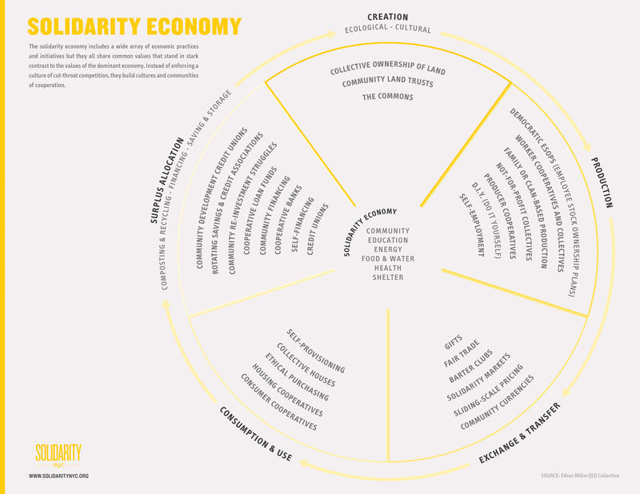

Una economía tecnocrítica debería basarse en cadenas de producción que
sean cíclicas y ecológicas, además de proponer trabajos orientados a la
economía de la regeneración para generar empleos que restauren el
medioambiente.

{#fig:circuleco
width=".9\\linewidth"}

Frente a la falta de fundamentos teóricos de muchas propuestas políticas
contemporáneas, nosotras creemos que el mundo donde caben muchos mundos
se nutre de *una ecosofía (un saber desde la Tierra), xenofeminista (que
entiende las formas de opresión como el género, la raza o la clase
social como tecnologías) e interseccional (que considera que distintas
violencias se intersectan en las subjetividades)*. Es a partir de esta
posición que tiene sentido para nosotras pensar una consideración
estratégica sobre la práctica política. Hay que ir más allá de las
adherencias identitarias a una facción política. Por ejemplo, la
dialéctica entre horizontalismo y verticalidad es un falso dilema, ambas
formas conviven en todas las relaciones grupales. Más allá de una
nomenclatura en particular, nuestra posición siempre es tecnopolítica y
busca prácticas anticapitalistas y antiestatales, creando comunes que
permitan la gobernanza de grupos que pueden reapropiarse el valor del
globalismo, descentralización, sociocracia, etc, entendiendo las
subjetividades más allá del control administrativo central de la
sociedad, es decir, de las normas que configuran los vínculos sociales.

La economía del don es parte de la visión de los comunes. Existen
ejemplos como Grameen Bank que contribuyeron a terminar con la situación
de pobreza de muchas personas en la India. Pese a que reproduce en
cierto grado la lógica que las produce, sí logran generar un cambio de
alto impacto. Es decir, escalable. Se trata de hacer modelos para
descubrir, por ejemplo, cuántas vidas puede salvar tu proyecto, qué tan
capaz es de visibilizar y crear alternativas a las violencias
estructurales que sufre una persona, y encontrar proyectos clave que
reduzcan transversalmente distintas formas de violencia al mismo tiempo,
algo parecido al principio de Pareto.

El punto central de este apartado es señalar que la imaginación política
presupone ciertas formas de hackeo a los dispositivos que dan fuerza a
todo el embrujo mercantil, que son las formas abstractas de valor. El
arte y el dinero tienen una relación importante en cuya génesis se
pueden explorar algunas posibilidades de emancipación. La meta es
reducir la dominación mercantil en estructuras económicas productivas.

<figure id="fig:Haiven">

<figcaption>Recomendamos el texto de nuestro colega Max
Haiven.</figcaption>
</figure>

## Principios para la acción efectiva {#cha:principios}

Por ahora, frente a la acelerada decadencia de nuestros vínculos
políticos, creemos que es necesario crear un ecosistema de tecnologías
cívicas para hacer efectivas las garantías jurídicas a las personas
ciudadanas que, por sus condiciones particulares, no pueden tener acceso
a la justicia o al gobierno. Este movimiento tiene que luchar por una
cultura pirata, es decir, concentrada en hacer libres, abiertos y
accesibles todos los recursos de los que dispone. De la misma manera,
necesitamos desarrollar principios de política pública, de economía y de
gobierno, que se vuelvan el sentido común de tanto de las planificadoras
como de las estudiantes de las escuelas de negocios y de administración.
En cierto sentido, se trata de desarrollar un nuevo pensamiento
económico que haga frente a la visión neoclásica de entidades racionales
y maximizadoras de utilidades. En cuanto a nuestra estrategia, nos
reconocemos en una tensión entre la transparencia y la opacidad. Sabemos
que el humor juega un papel fundamental en la conformación de un nuevo
imaginario político. Hasta ahora, hemos pensado en algunos principios
como parte de una visión efectiva de la táctica política progresista:

### Pragmatismo no es utilitarismo {#sec:pragmatismo}

Muchas personas casadas con la Teoría crítica (marxismos, psicoanálisis,
etcétera) satanizan la filosofía del hacer efectivo y eficiente.
Nosotras pensamos que esta actitud de repudio a la estadística, a la
optimización y a la eficacia son lo que nos ha valido tantas derrotas.
Podemos pensar las cosas más románticas del mundo sobre la revolución,
pero la realidad es que toda operación requiere un pensamiento
estratégico, requiere instancias (es decir, medios concretos de
ejecución, como el código en computación) y que no lograremos disputarle
el sentido común al neoliberalismo, ni imaginar un más allá del Estado o
del capitalismo si no pensamos que teoría, estrategia y práctica están
interrelacionados y que no bastan buenas intenciones. Como lo señala
Alinsky en su Tratado para radicales, las cuestiones morales no tienen
ningún sentido frente a nuestros enemigos. Ahí mismo señala que la
historia nos ha enseñado que primero se toma la acción y después se
legitima.

<figure>

<figcaption>Bernie Sanders, Alexandria Ocasio Cortés y el <em>Green New
Deal</em> son un buen ejemplo de pragmatismo con sentido.</figcaption>
</figure>

### Interseccionalidad en la acción {#sec:interseccionalidad}

Que todas nuestras acciones estén centradas en atender las condiciones
estructurales de opresión a través de un movimiento emancipatorio que
busque hacer frente de forma transversal a las diversas formas de
violencia que padecen las personas. Para lograrlo, es necesario que
entendamos cómo funciona el capitalismo hoy en día, en un contexto donde
la fuerza de trabajo está totalmente precarizada, pulverizada y
disuelta, en una época económica conocida como posfordismo, que consiste
en una era donde la producción está profundamente ligada a la teoría de
la información y de la computación. La interseccionalidad nos obliga a
concentrarnos en desarrollar herramientas para comprender cómo funciona
la explotación en sus distintas formas, por ejemplo, cómo se intersectan
las violencias de género, racistas y de clase.

<figure id="fig:dimensiones">
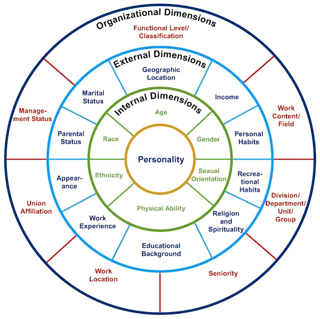
<figcaption>Dimensiones de la personalidad y factores de
influencia.</figcaption>
</figure>

### Transmisibilidad, o sea, hacernos accesibles {#sec:transmisibilidad}

Si la ideología es el conjunto de significados culturales que nos hacen
estar a favor o en contra de algo, necesitamos crear mecanismos de
reconocimiento y traducción de estos significados para poder
transformarlos. La mayoría de las personas no está realmente convencida
de todo lo que cree y muchas veces lo cree más por ser receptora de un
flujo de imágenes o de opiniones de gente con reputación social, que por
su propio convencimiento. Ese es nuestro objetivo, ser capaces de
comunicar a esas personas una visión comprensiva de la diferencia, de la
otredad, de la dignidad del prójimo. Debemos hacer que nuestro discurso
sea trans-ideológico, que pueda dialogar con distintas visiones
reapropiándose y resignificando conceptos cooptados por conservadores y
tradicionalistas (es decir, la derecha). Esta idea es parecida a lo que
en ciencias sociales se conoce como intersubjetividad, que es la
capacidad de las hablantes de crear significados comunes y compartidos
que configuran su sentido común. Para lograr ser transmisibles,
necesitamos más mercadotecnia para transmitir una cultura crítica y para
comunicar el feminismo y la teoría crítica a gente que sabemos que
podría accionar hacia una causa en particular, induciendo una disonancia
cognitiva. Pensémoslo como si estas personas fueran *swing voters* que
tienen que elegir entre el sentido común neoliberal que las aliena o una
visión crítica que las ayuda a reconocerse como personas con dignidad
más allá de los códigos sociales. Pero no podemos hacer esto si no
pensamos en los códigos de quienes nos escuchan. En el Corán, la
*taqiyya* o *kitman* es el acto de disimular nuestras propias creencias
en tiempos de persecución. Necesitamos disimular nuestras creencias y
visibilizar mensajes seleccionado cuidadosamente para que logren
insertarse en los flujos de deseo del capitalismo sin que el enemigo nos
reconozca.

<figure id="fig:he4she">

<figcaption>Emma Watson, vocera del <em>He for She</em>, una forma de
<em>mainstreaming</em>.</figcaption>
</figure>

### FLOSS y la bandera pirata {#sec:FLOS}

En la jerga *geek*, *Free/Libre and Open Source Software* (FLOSS) es el
tipo de software accesible a través de su código fuente. Esta filosofía
es absolutamente necesaria para una práctica que permita el autogobierno
de las personas y reduzca la dependencia del Estado y a los mecanismos
tradicionales de gobierno, así como el poder de mercado de las
corporaciones a través de las patentes. Nosotras añadiríamos *Free/Libre
and Open Source Culture* (FLOSC) para referirnos a un desarrollo en la
cultura donde los procesos de creación de valor y de desarrollo de
productos sean visibles y no ideológicos, es decir, que sirvan para que
más gente pueda producir sus propios significados y sus propias
estéticas y no para que sea utilizado para que la gente reproduzca un
modelo de consumo (que es la función de la ideología). La cultura FLOS
debe extenderse al espacio público, a la Academia, a los mercados (que
hoy en día pertenecen a horribles lagartos que, a través de cinco
empresas, controlan los flujos de distribución de mercancías y de
imágenes en todo el planeta), a la educación y a todas las instituciones
que reproducen el estado actual de las cosas. Esto significaría que el
gobierno deje de operar empresas estatales y que más bien permita sus
operaciones públicas, a través de certificaciones y procesos de
descentralización, y no a través de la concesión a grandes monopolios
transnacionales.[^21]

Respecto a la cuestión de las patentes, hay ideas muy interesantes como
el *copyleft* o el *copyfair* que buscan reformular patentes y crear
esquemas que fomenten cooperativas. Nosotras pensamos que este tipo de
prácticas podrían servir en las licitaciones gubernamentales para
generar leyes que obliguen a las instituciones públicas a tener procesos
y patrones de cultura FLOS.

Otra idea con la que hemos coqueteado es con las etiquetas o *labels* en
inglés. Por ejemplo, una etiqueta *Low tech* que certifique que ciertos
productos desarrollados fueron diseñados como alternativas a la
obsolescencia programada y con la posibilidad de intervenir sobre ellos.
La idea de la etiqueta surge como una forma de crear un sistema de
certificados que pueda competir con la lógica capitalista de producción
de las grandes marcas, con la intención de desacelerar los ciclos de
producción y consumo.

Algunas referencias interesantes para complementar este apartado:

<http://unenumerated.blogspot.com/2017/02/money-blockchains-and-social-scalability.html>

<http://unenumerated.blogspot.com/2006/11/wet-code-and-dry.html>

<figure id="fig:lowtech">

<figcaption>Imagen del sitio <em>Low Tech Magazine</em>.</figcaption>
</figure>

### Queremos un mundo más allá de la economía capitalista {#sec:mundo}

Algunas personas dicen que incluso si acabáramos con el capitalismo como
forma de explotación, todavía habría que pensar en cómo ir más allá de
relaciones sociales mediadas por abstracciones como la moneda. ¿Por qué?
Cada vez presenciamos cómo hasta la última esfera de la vida está sujeta
a la regulación, a la medición y a la cuantificación. Esto nos impide
vivir sin considerarnos a través de márgenes de utilidad y hace que nos
sigamos mirando las unas a las otras, al menos parcialmente, como
objetos de interés. La cibernética es la ciencia y arte del control que
cuantifica cada vez más toda experiencia de vivir en *clicks*, en
*shares*, en *likes*, y esto no hace sino aumentar el deseo de
enjuiciarnos cada vez más. Una posible solución está en pensar que las
tecnologías que desarrollemos para crear un Estado más justo también
tienen que preguntarse cómo haremos para generar más vínculos, más
encuentros donde las personas puedan hablar, escucharse y establecer
vínculos más allá de la pertenencia a una tribu identitaria o a
cualquier grupo de interés. Creemos que el verdadero problema de la
tecnología es su desarrollo capitalista, que desorganiza a las personas
para volverse cada vez más necesaria.

Para lograrlo, podemos valernos de investigaciones como *Nudge economy*,
parte de la economía de la conducta que analiza el diseño de incentivos
que conducen a la gente a tomar decisiones, es decir, la disposición
económica de los objetos a las personas. En este campo es también
posible vincular la experiencia de usuario o UX (*user experience*) para
hacer interfaces más accesibles e incluso más comunitarias.

<figure id="fig:potlatch">
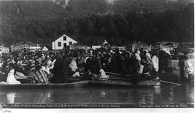
<figcaption>El <em>potlatch</em>, concepto clave en la economía del don
de Marcell Mauss, es un ritual de los pueblos aborígenes de la costa del
Pacífico en el noroeste de Norteamérica, tanto en los Estados Unidos
como en la provincia de la Columbia Británica de Canadá.
EE.UU.</figcaption>
</figure>

### Luchemos por estar en los canales masivos {#sec:luchemos}

El algoritmo del capitalismo funciona implantándonos deseos de consumir
y de cumplir ciertos códigos sociales que siempre tienden al
individualismo y a la mercantilización de las otras personas. No creemos
en la falsa dicotomía entre luchas locales y globales, creemos que hoy
en día, toda forma de activismo es una cierta tecnopolítica. Es decir,
que nuestras prácticas contienen cierta posición estratégica sobre el
uso de los recursos en decisiones tan básicas como usar manuales de
*zero waste* en eventos públicos y hacer campañas para hacerlo una moda.
Si realmente queremos hacer algo efectivo, tenemos que crear un
*mainstream* o corriente mayoritaria que permita unir distintos
proyectos que luchan por la emancipación así como los ingleses tienen
BBC como distintivo de su identidad y de su cultura.

El trueque, el *freeganism* o los bancos de tiempo son estrategias de
resistencia que por sí solas, aisladas en contextos locales, de
micropolítica, no pueden hacer nada para ganarle a los millones de
dólares que la industria de la comida rápida invierte en hacernos desear
el azúcar, las grasas y cualquiera de esas sustancias que nos restan
salud. Sin embargo, combinadas en una campaña masiva y consolidando
audiencias que puedan encontrar alternativas sistémicas como salud
pública y comedores comunitarios, empezaremos a tener victorias reales.
Es decir, hay que crear flujos alternativos a la cultura de masas que
tengan aspiren a una plataforma común de organización, para hacer
publicidad no a un proyecto de bajo impacto en particular, sino a una
alternativa sistémica y escalable. Para nosotras, Wikipolítica fue la
muestra de que tenemos la capacidad de hacer funcionar una maquina capaz
de hacer campanas de mercadotecnia con alcance nacional que lleguen a
diferentes segmentos e incluso lleguen a medios masivos internacionales.

### La crítica debe enfocarse en las tecnologías que producen la opresión {#sec:critica}

Nuestro discurso debería ser interseccional e incluir en su agenda un
conjunto de propuestas sistemáticas en torno a cada lucha particular. En
la dinámica actual del capitalismo, hacer uso de las marcas puede darle
más poder a la lucha. Necesitamos crear una red para consolidar, para
entablar puentes de colaboración de saberes técnicos. Es importante
mencionar que en la cooperación técnica se pueden hacer progresos
discursivos paralelos, una identidad mínima interseccional, un vínculo
común de articulación para la comunicación estratégica de una red de
círculos que construyan una plataforma con procesos y patrones en común
para incentivar la participación política.

Se nos ocurre que incluso sería buena idea hacer campamentos de
inteligencia colectiva. Estos deberán operar a través de la escucha y
plantear preguntas de empatía: ¿cómo se sienten hoy? ¿Cuál fue tu logro
más importante de esta semana? ¿Qué problemas hay en la organización?
¿Qué respuestas podemos crear desde nuestra posición para solucionar el
problema? ¿Cómo se sintieron con esta dinámica? Nos imaginamos talleres
diversos, como educación popular, herramientas de mapeo, el buen trato
como estrategia de lucha, participación ciudadana, herramientas
filosóficas, lluvia de ideas y dinámicas de inteligencia colectiva para
una cartografía de controversias.

Hoy en día es posible desarrollar la economía social para tratar de
enlazar distintos proyectos de resistencia, basados en estructuras de
micro mecenazgo. El horizonte educativo podría ser una cruzada contra el
analfabetismo digital, con la intención de que todas las personas puedan
navegar en la complejidad de la era de la información.

## La organización que construimos {#cha:organizacion}

### Sobre el asunto de la estrategia y la táctica {#sec:tacticaestrategica}

Los principios de una organización deben combatir el capitalismo a
diferentes escalas, refiriéndose a la otra persona, a los grupos de
personas y al propio cuerpo. Antes habíamos señalado que las formas de
opresión tienen manifestaciones macro y micro, que bien pueden
entenderse como globales (o económicas, sobre el acceso a los recursos y
a los mercados) y como locales (o corporales, sobre las convenciones
sociales que rigen nuestra vida cotidiana). De un modo parecido, la
acción política puede entenderse desde dos aristas que se entrecruzan:
la estrategia, la táctica y la organización. La estrategia atañe a lo
global, a las grandes estructuras que dan forma a las interacciones
económicas a escala masiva mientras que la táctica se refiere a los
detalles de implementación para grupos concretos, a nivel local. Si lo
pensamos en relación con un partido político, las estrategias tienen que
ver con el desarrollo de un programa política, un plan de gobierno y la
creación de un horizonte de acción mientras que la táctica está más
relacionada con las acciones concretas que nos llevarán a la victoria,
como ganar una elección o el cabildeo para pasar una ley a través de
litigio estratégico e intervenciones mediáticas.

Sin embargo, hasta ahora no queda tan claro cómo interactúan la
estrategia y la táctica. Es ahí donde entra el rol de la organización.

Para crear una fuerza política que vaya por la toma del poder, tenemos
que construir un plan de gobierno deliberado al que tienda el sistema de
partidos basado, entre otras cosas, en la noción de soberanía
tecnológica.[^22] La tarea es crear una plataforma global que nos
permita organizarnos mejor como un todo, darle mayor poder a nuestras
luchas como una confederación de colectivos o algo así. Esta tarea no es
sencilla y descansa, en última instancia, de la confianza que exista en
las otras, todo el tiempo. Para hacer frente a ello, necesitamos salir a
la calle y ahí está el gran acierto de Wikipolítica, en salir a tocar
puertas. Salir a la calle es abrirnos, es dar vida a un movimiento
social que, entre otras cosas, tome las elecciones populares como una
oportunidad de articulación. Lo federal solo es necesario en la medida
en que apoye una agenda local, estrategia electoral municipalista.
Dentro de nuestro programa político está la urgencia de abrir hasta el
último dispositivo que perpetúe, bajo la servidumbre, un grado de
opresión tal que imposibilita que una vida particular no pueda
desarrollarse como potencia.

Para hacer una opción electoral fuerte necesitamos crear una propuesta
integral de gobierno que sea capaz de integrar diversas agentes y una
maquinaria electoral que garantice la fiabilidad de las representantes.
Muchas activistas no tenemos idea de cuáles son los retos cotidianos de
la vida real, de la gente. Nuestra idea de un cambio estructural tiene
que ver, precisamente, con afectar las estructuras que generan opresión
sistemáticamente para la mayoría de las personas.

Para quienes disputan los puestos de representación, hay que tener muy
claro que las campañas electorales son un proceso, no un fin en sí
mismo. Antes de pensar en elecciones, es importante que los grupos
políticos se pregunten cómo conformar una base social que sea capaz de
producir flujos de interconexión, como el mostrado en el diagrama 2.1.
Por ahora, sin estructuras políticas suficientemente inteligentes y
resilientes, hay que promover la operatividad de todas las
organizaciones pensándolas como entidades completas cuya primera tarea
es garantizar la subsistencia y las necesidades mínimas (como las
señaladas por Maslow en su famosa pirámide de necesidades) permitiendo
que haya distintos proyectos que generen recursos propios, pero que
gocen de una membresía común que les ayude a organizarse y a conectarse
con otras redes de resistencia y colaboración. Para lograrlo necesitamos
implementar operaciones de inteligencia sobre el tráfico de la red,
entender de qué modo, bajo qué significantes, opera el *statu quo*. Es
decir, cuáles son los conceptos que están en disputa para llevar nuestra
visión de cómo *nos* gobernamos en dirección no sólo a las urnas, sino a
la calle, a la acción cotidiana.

A diferencia de un partido, que opera bajo la lógica de competencia de
un sistema que busca ganar, un movimiento social puede permitirse crear,
conectar y estructurar esfuerzos paralelamente e incluso al interior de
los partidos, señalando los problemas fundamentales de éstos en función
de un marco teórico deliberado entre bases, sociedad civil,
intelectuales y artistas, y proponer soluciones a esos problemas. En
este caso hipotético en el que, después de la deliberación, existiera un
proyecto político claro y deliberado por diferentes sectores, los
partidos que desearan sobrevivir tendrían que limitarse a ejecutar las
metas trazadas por los distintos grupos, y representadas bajo una
agrupación de medios de comunicación. En este sentido, el gobierno y el
sistema de partidos perderían buena parte de su poder doctrinario para
limitarse a cumplir funciones meramente técnicas. Para hacer una
transformación histórica, necesitamos ser un espacio de encuentro entre
academia, sociedad civil, empresarios, medios, sindicatos,
organizaciones de base y opinión pública. Concentremos nuestros
esfuerzos en hacer que la agenda sea un conjunto de compromisos a largo
plazo ---junto con nuestras líneas de acción--- mientras conformamos un
proyecto político bien organizado y con plataformas tecnológicas chidas.

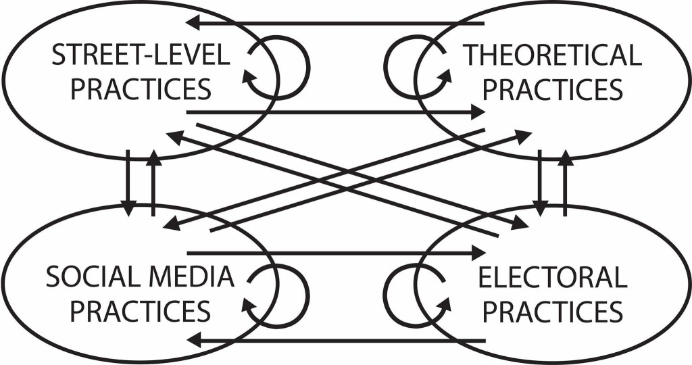

Una vez que logremos consolidar una infraestructura común y dinámicas
para comunicarnos, es necesario que abramos canales de comunicación.
Para lograrlo, podemos recurrir a estrategias muy antiguas, pero
igualmente efectivas bajo una gran organización técnicamente capaz de
hacer una democracia efectiva: Periodismo popular, repartido en lugares
de resistencia a través de estructuras distribuidas por todo el país,
donde los contenidos puedan enlazar realidades locales con la nacional.
En realidad, la presencia de una organización política en el territorio
no significa que haya buenas razones para ocuparlo, la razón por la que
nos presentamos en la calle es quizá una de las cuestiones más
importantes a resolver. Por ejemplo, adoptar una agenda municipalista
sería un excelente horizonte para un movimiento que busca ocupar las
instituciones del poder. Las propuestas de Murray Bookchin, ecologista
estadounidense, pueden convivir con otros esfuerzos de organización
comunitaria como los desarrollados por Saul Alinsky y Marshall Ganz.
Quizá la razón más vital para salir a la calle sea la más poderosa. El
carnaval, la festividad profana de lo público, la danza libre y el
encuentro de los cuerpos, sería un gran pretexto. ¡Salgamos a la calle a
divertirnos y hablar de lo político! También puede servir para redefinir
nuestra concepción de un mercado libre y abierto.

Se pueden conciliar movimiento y elecciones a través de participación
escalonada que se gestione a través de una plataforma web, así como
plantear acciones importantes pero no urgentes para la organización y
para desarrollar el movimiento. Esto para hacer una mancuerna operativa
con las personas que consideran que conquistar espacios de poder es la
tarea urgente, pero que estarían de acuerdo con abrir la organización
para que estas acciones importantes empiecen a ocurrir porque somos una
wiki inteligente, que entiende el aspecto multidimensional de sus
operaciones. Imaginamos una apertura escalonada de información, según lo
que la gente quiera compartir y lo que la wiki haya ganado por su mérito
de honorabilidad. *Hay que entender que hoy es posible programar la
gestión de responsabilidades orgánicamente.* Las alianzas deben
permitirnos articular una red electoral, un plan de gobierno y un nuevo
proyecto constitucional, desde una perspectiva abierta, transparente y
*FLOSS*. Consideremos que hay una asimetría en acceso a redes que hacen
que gente menos experta o que ha pasado menos tiempo en la red tenga
mayores dificultades para integrarse. Por esta razón no sabemos dar
cauce a muchas ideas que son potencialmente grandes proyectos. Más allá
de la preocupación, porque un grupo de poder coopte la organización, hay
que pensar que es necesario que el movimiento se fragmente y diferencie
a partir de recursos comunes, bajo una visión modular y escalonada de
los progresos de nuestra estructura política.

{.uri} te permite organizarte
en listas y tableros.](caltra.jpg){width=".9\\linewidth"}

El problema de la documentación de un movimiento político que busque la
libertad real de todas las personas es una preocupación muy presente
desde Podemos, pero realmente constante a lo largo de la historia. El
problema más importante hoy en día para los movimientos autogestionados
se conoce como la *tiranía de la no estructura.* Un problema difícil de
enfrentar es que, en relación con el estado actual de las cosas, solo
podemos ver lo que nos queda y muy pocas veces lo que nos ha sido
arrebatado o todo lo posible, un horizonte imaginario de formas de
organización, de diálogo, distintas. La cuestión de la inteligencia
colectiva no puede quedarse como un instrumento más para agilizar la
productividad. Mucha gente en Wikipolítica no se da cuenta lo útiles que
resultan al Imperio con el burdo aceleracionismo de blancos por el que
sienten tanta simpatía. Para hacer frente a estas cuestiones,
necesitamos mecanismos para profesionalizar el activismo y la
militancia, mecanismos de sistematización de experiencias. Partir de
esto para diseñar un programa de crecimiento dirigido, comprensivo y
estratégico, una suerte de comunidad de inteligencia. Tenemos
oportunidad de usar y desarrollar plataformas tecnológicas para
gestionar procesos que ahora son inoperables bajo la tecnología que
tenemos ahora. Para lanzar una campaña de crecimiento dirigida al
territorio necesitamos despliegues de profesionales en Trabajo social en
Comunicación. Es decir, necesitamos pensar estratégicamente. El problema
es que entre muchas personas es moralmente incorrecto repetir

En Wikipolítica muchas veces nos preguntamos sobre las características
de un posible espacio wiki oficial. Con el tiempo, estamos más
convencidas que se trata de plantear qué significa un espacio wiki,
preguntarnos cómo inspiramos a otras personas a crear espacios bajo una
filosofía común. La ideología es la máscara a través de la cual vemos
las cosas.

El diseño es parte de una propuesta de inteligencia que, a través de
procesos de iteración y prueba, logra crear relaciones de experiencia
entre las cosas y las personas. Creemos en el valor del Diseño como
disciplina fundamental para la transmisión de un medio popular. Nuestro
*código* tiene que pensar en las instituciones a través del Diseño
social. El resultado será mecanismos que incentiven la participación más
allá de la lógica utilitarista, fundamento de la magia negra. La única
restricción serían las manifestaciones de totalitarismo, como la
intolerancia, el autoritarismo o la intransigencia. Los discursos que
atenten contra la determinación libre y voluntariosa de la persona deben
ser contenidos y este es un límite al que no estamos dispuestas a
renunciar.[^23]

Por ejemplo, aprender a pensar en instancias para crear protocolos
comunes de distintas luchas como las tecnologías de *performance* o la
táctica del brigadeo. Operaciones orientadas a proyectos, donde las
estructuras nazcan y mueran, sean ocupadas, como los hackerspaces.
Metodologías de organización para y desarrollo para personas como SCRUM,
design thinking, UX, grupos de agilismo, Workcafé. Otra tarea es
consolidar un equipo de relatores que puedan sistematizar con
rigurosidad los resultados de todas las discusiones, pues parece que la
relatoría presupone más habilidades para la síntesis y la estructuración
discursiva de lo que podría parecer.

La cuestión de una plataforma política puede funcionar muy bien como un
proyecto modular de fuentes libres y abiertas basado en tecnologías que
ya existen, como Decidim y las metodologías de gobernanza en círculos
llamada Sociocracia. Con esta visión es muy factible desarrollar una
estructura informática con directorios, sesiones de planificación y
estrategias de mercado, asesoría para participar en convocatorias y
solidaridad para que quienes quieran, se apoyen. Solo habría que
considerar que el crecimiento esté dirigido estratégicamente hacia redes
y personas clave en agendas específicas, además del mero crecimiento
territorial. Necesitamos comprometernos con sentar un precedente
operativo basado en nuestro potencial tecnológico. Si lo hacemos bien,
la necesidad de apertura de otras asambleas políticas en el país se
esparcirá como un meme (virus cultural), que permita que todas tengamos
los saberes necesarios para organizarnos en torno a lo común.

En términos estratégicos, es mejor dar un golpe nacional de la nada, con
precisión y organización, con artistas, académicos, opinión pública y
otros sectores, que el desgaste que implica concentrarse en un solo
proyecto de corto plazo, como una campaña política o una petición
legislativa sin ninguna repercusión estructural. Mejor esperar unos años
hasta que tengamos una organización poderosa. Abrir la organización con
un movimiento nacional que siente las bases para un proyecto político
fuerte y de larga duración.

Representación de convicciones políticas, agendas desde subjetividades
reconocidas y desde los territorios. Burocracia media en sindicatos o
partidos. Diferencia y relación entre sindicatos y partidos. Redes
interuniversitarias. Necesitamos regulación de proyectos económicos a
través de sus limitaciones. Es decir, si la industria editorial genera
capital que se acumule en pocas manos (lo que significa menores ingresos
tanto para escritorxs como para lectores), ser el espacio y respaldo de
la innovación de nuevos modos de financiamiento, quizá haciendo
hackatones o dando prioridad al tema en las agendas de un período y una
región en particular. Hackatones sociales o alguna iniciativa donde
podamos ser facilitadoras de distintos fondos públicos locales. En el
terreno económico podemos jugar el papel de gestoras para cooperativas
de consumo que compartan una identidad y principios wiki que permitan
que muchas familias puedan empezar a adquirir sus bienes en redes
sororas.

### ¿Cómo entender los problemas de nuestro país? {#sec:problemaspais}

El Estado en México es un orden social de acceso limitado, hay que
pensar en systems thinking para crear un *frame* que comprenda
necesidades para ajustar la plataforma política al contexto de
institucionalidad y reglas del juego propias de cada arreglo. Habría que
partir de una visión combinada de psicoanálisis, diseño y economía de la
conducta. Hay que hacer una lista de problemas principales a resolver,
por ejemplo:

#### Problemas de diseño de sistemas: {#sec:probsis}

-   Interfaces y experiencia de usuario comunitarias y accesibles

-   Teoría del empujón para incentivos económicos a cooperativas y
    apropiaciones comunitarias del espacio público

#### Problemas de acción colectiva {#sub:probaccion}

##### Económicos {#subs:economicos}

Asimetrías de información:

:   cómo hacemos que la gente tenga los mismos insumos para tomar las
    decisiones más benéficas para las comunidades en un mercado complejo
    de transacciones en tiempo real

Problema del agente-principal:

:   abolir las altas tasas cobradas por coyotes que dan sentido a la
    figura del Estado como recaudador central que redistribuye el
    ingreso

Tiranía de la no estructura:

:   sistemas de toma de decisiones para la participación escalonada y
    remunerada de diferentes agentes con un objetivo común de
    solidaridad económica

Comunes:

:   formalización en protocolos y procesos de una cultura de los bienes
    y servicios comunes que se gestionan, se actualizan y se mantienen a
    través de contribuciones preestablecidas en contratos inteligentes

##### Psíquicos {#subs:psiquicos}

*Schadenfreude*:

:   cómo crear grupos de personas con adicciones, resentimientos o
    comportamientos tóxicos que sienten placer por el sufrimiento del
    prójimo, y comenzar procesos de sanación colectiva descentralizados,
    como Alcohólicos Anónimos.

Narcisismo de las pequeñas diferencias:

:   Construcción de una cultura política que procure las alianzas y
    permita canalizar los disensos. Un ejemplo muy claro para la
    construcción de organizaciones que hagan frente a este tipo de
    cuestiones es la Sociocracia.

<figure id="fig:nudge">

<figcaption>El libro <em>Nudge</em> es una gran referencia para entender
el poder del diseño y la economía del comportamiento en la solución de
problemas públicos.</figcaption>
</figure>

### Consideraciones sobre la organización {#sec:considerorga}

Las herramientas ya existen, es poco trabajo en interconectarlo
(compatibilidad de tecnología), hay que enfocarnos en la adopción a
través de talleres y eventos de accesibilidad, de editorializar una base
de datos opinionated suite de trabajo militante), de garantizar
protocolos de seguridad: decentralizacion, permisos (gestión de
identidad) (Pursuance, sneakernet y otras tecnologías). Tenemos que
desarrollarlo poco a poco a través de una arquitectura modular y
distribuida, que permita ensamblar diferentes tecnologías según las
necesidades de la persona usuaria.

El problema principal para un movimiento horizontal es el problema de la
*no-estructura*. Dentro de las estrategias, podemos proponer visiones
para que los emprendedores entiendan como disruptivo lo que es
estructural. Se trata de reapropiarse del concepto de dinámica y
participativa, pensar que sea una gobernanza basada en *outputs* o
resultados sin que se vuelva una cosa individualista de *tracking* de
*performance* individual. El objetivo es crear una estructura de los
comunes (Elinor Ostrom), además de fortalecer sindicatos, acelerar
cooperativas y democratizar decisiones corporativas, facilitar
*self-management*y en un movimiento .

Para lograrlo hay que retomar la paradoja de la sistematización de
actividades ¿creamos y documentamos procesos o patrones? ¿Realmente vale
la pena un modelo de gobernanza como sociocracia?

Recursos interesantes para este apartado:

Github: The GitHub Debacle and Why Holacracy is Bullshit
(counter-response)
<http://cbracy.tumblr.com/post/79876957198/the-github-debacle-and-why-holacracy-is-bullshit>

## ¡Accionemos! {#cha:accionemos}

¿Qué podemos hacer? Nuestra posición es una práctica pragmática y eficaz
desde el xenofeminismo como filosofía de inspiración de La Partida. Más
allá de la coherencia moral, nos interesa agruparnos con formas de vida
que nos hagan potentes, es decir, en las formas de vida que procuran el
cuidado, el bien común. Por ahora, con nuestra agencia limitada por la
poca credibilidad de la juventud, nos toca infiltrarnos e incidir en
diferentes medios, en partidos políticos, organizaciones
internacionales, medios de comunicación masiva y segmentada, entre otras
estructuras.

<figure id="fig:silvestri">

<figcaption>Leonor Silvestri, feminista argentina y activista de los
afectos alegres con excelentes reflexiones en YouTube.</figcaption>
</figure>

### Algunas posibles acciones estratégicas {#sec:posiblesacciones}

Un Centro de Estudios que brinde a las personas que estudian ahí
capacidades de formación en medio de la complejidad y que formen
generaciones dispuestas a accionar desde una perspectiva
transdisciplinaria y colaborativa, lejos de los dogmas y formalismos de
la academia. Como el proyecto de Nick Srnicek con Hellen Hester,
autonomy.work. Dentro de los proyectos claves vemos:

Un *think tank* para generar líderes con conciencia crítica, de
estrategia y táctica política, además de informes de política económica
de desarrollo local y estrategias para hubs y hackatones, además de
programas de litigio estratégico rumbo a la creación de un programa de
políticas publicas poscapitalista. Necesitamos crear lazos con los
entornos tecnológicos progresistas y radicales para poder crear
productos accesibles en los mercados que puedan generar bienestar para
muchas personas, por ejemplo, a través de franquicias cooperativas.

{#fig:autonomywork width="90%"}

Ademas, necesitamos crear una plataforma de organización política en
línea de arquitectura modular que sea accesible y fácil de implementar.
Un excelente punto de partida es el proyecto Decidim desarrollado en el
MediaLab en España. Nos imaginamos las bases de una interfaz para
discusión y gestión democrática de grupos, además de una wiki que
funcione como un repositorio copyfair editorializable. Ademas, con
tecnologías de georreferenciación.

En términos económicos, hay que crear un ecosistema que facilite la
proliferación y producción de redes solidarias. Más allá del movimiento
sindicalista, la cooperativa es una unidad económica que realmente
garantiza la igualdad democrática desde el trabajo. Quizá la forma más
sencilla de hacerlo sería a través de una franquicia cooperativista cuyo
soporte sea una wiki con manuales y procesos accesibles en términos de
diseño, que crezca bajo una etiqueta (*label*) que represente los
valores de esa marca cooperativa.[^24]

Finalmente, es necesario desarrollar un proyecto cultural transmedia que
funcione a través de esta lógica y que permita el desarrollo de una
cultura popular independiente del mercado *mainstream*. Algo de
inspiración para una aventura de esta naturaleza han sido los *Street
papers* y proyectos como la Red de Producción y Distribución Vicente
Guerrero en México, el manifiesto del Dogma 95 y el formato de
producción de bajo costo desarrollado por Robert Rodriguez en su famoso
libro *Rebel without a Crew*. En resumen, una cultura de producción
*guerrilla cinema*. Las películas *Tangerine* en Estados Unidos y *Oso
Polar* en México son una muestra de las posibilidades técnicas de los
medios contemporáneos. Sin embargo, el horizonte de un esquema de
producción audiovisual militante es ContraPoints, un vlog en YouTube
estelarizado por Natalie Wynn.

<figure id="fig:Wynn">

<figcaption>Natalie Wynn, creadora de ContraPoints.</figcaption>
</figure>

### Organízate e independízate del Capital {#sec:independizate}

Finalmente, lo más importante es encontrar la forma de compartir
recursos que nos permitan crear redes de solidaridad en la producción de
insumos clave para cubrir necesidades básicas de grupos y comunidades.
En un sentido meramente estratégico, la pirámide de Maslow nos da pistas
de las industrias que habría que comenzar a cooperativizar para crear
multitudes que se emancipen de los flujos farmacopornográficos,
chatarrofágicos y financieros que produce el capitalismo.

{#fig:maslow
width=".9\\linewidth"}

Económicamente, problemas como el hambre o la vivienda pueden resolverse
con técnicas avanzadas de planificación y coordinación que no podían
realizarse en el socialismo de hace casi un siglo por la sencilla razón
de que no contaban con las herramientas computacionales necesarias para
poder pensar con seriedad en una economía planificada que publique
precios y soluciones conflictos de asimetrías de información en el
mercado.

Hoy tenemos la capacidad de no solo permitir la proliferación organizada
en plataformas comunes de productoras descentralizadas que surtan en
función de necesidades y no de plusvalía financiarizable, también
podemos implementar sistemas de votación para que estas organizaciones
no sean, como lo fueron durante la revolución mexicana, la base de un
corporativismo de corte charro. Podemos crear plataformas de economía
solidaria capaces de gestionarse autónomamente a través de recursos
iterativos de código FLOS. En ese sentido, una etiqueta de franquicia
cooperativa sería una buena forma de crear documentación y procesos
comunes en un proyecto de riesgo compartido con un contrato claro e
incluso inteligente y encriptado.

[^1]: El manifiesto de estos dos proyectos se puede consultar en
    [custodians.online/spanish.html](custodians.online/spanish.html){.uri}.

[^2]: Hemos pensado en estas prácticas como transversalización, basado
    en el criterio de la ONU sobre *gender mainstream*.

[^3]: Salud como buen vivir, por encima de la concepción que define la
    salud en sentido negativo, como ausencia de enfermedad, como lo
    mínimo necesario para que las personas estén aptas para producir.
    <https://www.theguardian.com/sustainable-business/blog/buen-vivir-philosophy-south-america-eduardo-gudynas>

[^4]: El proyecto [decidim.org](decidim.org){.uri} es un buen ejemplo de
    plataformas de organización colectiva.

[^5]: El resentimiento de clase es, por ejemplo, la envidia que te
    produce tener que usar transporte público todos los días y estar
    expuesta a asaltos mientras que la persona de al lado, o de la otra
    colonia, viaja con chofer privado en un automóvil particular.

[^6]: [es.wikipedia.org/wiki/Economía_post-escasez](es.wikipedia.org/wiki/Economía_post-escasez){.uri}

[^7]: A ello habría que sumar el problema del deseo, pensar en los
    desarrollos cibernéticos de las economías libidinales o economías
    del deseo.

[^8]: Famosa por ContraPoints, su vlog en YouTube.

[^9]: Freud se refiere a esto como el narcisismo de las pequeñas
    diferencias.

[^10]: Garzon Espinosa, Alberto. "¿Qué es la financiarización?" en
    *Economía Crítica y Crítica de la Economía*. Disponible
    en: [www.economiacritica.net/?p=144](www.economiacritica.net/?p=144){.uri}.

[^11]: Para ello, recordemos que la experiencia humana es tan
    antinatural, tan *cyborg*, como una ciudad, como el internet o como
    la resina que implantan en tus dientes cuando tienes caries. Y que
    hablar de lo natural no implica de ninguna manera que algo sea
    justo. De ahí una frase que retoma el xenofeminismo: si la
    naturaleza es injusta, cambiémosla.

[^12]: (añadir de conspiradores y cómplices).

[^13]: Toda mercancía, en la medida en que produce al sujeto como un
    objeto del valor de cambio de la mercancía, también produce entre
    sujetos una relación de objetificación. Esta forma alienada,
    instrumental, de comprender a la otra persona se reproduce en su
    comprensión de "lo real". Es decir, que también produce una idea
    sobre la naturaleza. De ahí que el capitalismo no produzca otra cosa
    que hostilidad y desgaste, espacios inhóspitos, pues no concibe al
    mundo como otro sino como instrumento.

[^14]: Aquí, la apuesta del populismo de Ernesto Laclau y Chantal Mouffe
    se posiciona por la resignificación de estos conceptos en el
    "sentido común".

[^15]: De cierto modo, que el capitalismo se presente actualmente en su
    mayor apogeo a través de la industria farmacopornográfica (régimen
    toxicológico y semiótico-técnico), reproduce una concepción de la
    subjetividad como no castrable, cuyo horizonte parece ser el de
    autómatas dependientes del *soma* de Huxley, personas
    discapacitadas, incapaces de habitar, de subsistir autónomamente.

[^16]: Reddit. *Don't lie to yourself...P-M-O (PORN...masturbation and
    orgasm) IS THE PROBLEM. Masturbation is just the symptom.*
    Disponible en [bit.ly/2HuEoem](bit.ly/2HuEoem){.uri}.

[^17]: Vale la pena revisar las estadísticas del tráfico de pornografía
    en internet. Por ejemplo, la información que libera
    [PornHub](www.pornhub.com/insights/category/stats).

[^18]: Es decir, la enfermedad de la impotencia, del cuerpo enfermo,
    pauperizado, envenenado por las bombas mediáticas que producen la
    comida rápida o chatarra como lo deseable, como el lugar a donde
    gastar el salario. Se trata de un régimen alimenticio de productos
    vacíos, compuestos de harinas, grasas, azúcares y otras sustancias
    que funcionan bajo el mismo principio de estimulación-malestar y que
    producen serios daños al cuerpo a largo plazo. El paradigma
    mercantil de la comida en tiempos del Imperio.

[^19]: Que dan forma a la cultura popular y al espectador televisivo en
    un circuito que lo posiciona como ente pasivo sentado en un sillón
    consumiendo comida chatarra.

[^20]: Hemos utilizado la palabra raza para referirnos al discurso de
    raza, una ideología biologicista que sirve a los patriarcas blancos
    para justificar la opresión a grupos étnicos o a cualquier forma de
    vida no-blanca.

[^21]: Entendemos, sin embargo, que hay problemas importantes cuando
    pensamos en proyectos que son intensivos en capital, como grandes
    obras de infraestructura o complejas investigaciones médicas.
    También se trata de acelerar los procesos de democratización y de
    FLOS dentro de la estructura de las corporaciones, que hoy en día,
    son reinos, con el todopoderoso CEO (*Chief Executive Officer* o
    director general) gobierna sobre todos sus súbditos a través del
    salario.

[^22]: Un ejemplo de esto serían los incentivos a proyectos
    antimonopólicos, protocolos y librerías de acceso público para que
    cualquiera pueda entrar a la economía formal y tener acceso a
    servicios de calidad por parte del Estado.

[^23]: El mejor remedio para los fascistas de sonrisa cínica y espíritu
    perverso es molerlos a palos. Pero nos conformamos con que sean
    expulsados.

[^24]: Un ejemplo del crecimiento rizomático de una organización es la
    nevería mexicana La Michoacana.
